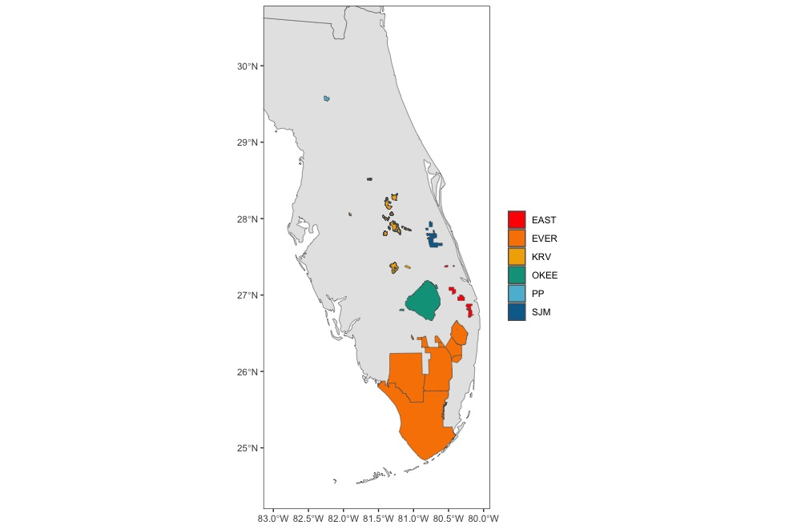
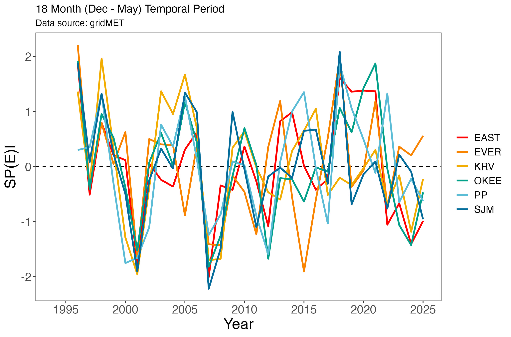

## Snail kite demographic PVA and other documentation

This is an R Markdown generated document. The goal of this item is to give a comprehensive documentation in the steps necessary to produce the parameter estimates and implementation of the Snail kite demographic Population Viability Analysis for the annual report. The documentation code was initiated by Nick Martin, and adjusted by Orlando Acevedo-Charry.

## Package Libraries and Source Code

This document uses an extensive library of packages and source code developed in and/or using R. But first it is important to set your working directory to the location in which you plan to store the data files. 

## Load Packages and source code
```{r Libraries, message=FALSE}
library(MASS)
library(expm)   #for matrix powers to calculate growth rate over time
library(tidyverse)
library(wesanderson) #for color palette
library(future)
library(furrr)
library(zoo) #for rolling sum to determine strings of years
library(ggplot2)
library(dplyr)
library(gratia)
library(jagsUI)
library(MuMIn)
library(DHARMa)
library(glmmTMB)
library(RMark)
library(car)
library(MASS)
library(expm)   #for matrix powers to calculate growth rate over time

source('R codes/helper functions_rf_new.R')
```

Once the packages are loaded we will start with estimating the breeding probabilities.

# Breeding Probability 

Load breeding status data and SPEI categories

```{r Breeding data}
# Dataframe including resight date, location, region, breeding status, and unique ids.
resights <- read.csv("data/Breeding Status PVA 2025.csv")
# Dataframe including region, SPEI category, and invasion status of the region for each year.
spei_inv <- read.csv("data/SPEI_per_yr_long_extreme_inv.csv")
```

The first dataframe describes the resight history, No idea where it came from! But it includes: `resight_date`, `survey_num` (the new survey_code; 1:6), `resight_loc` (area = 39), `breeding_status_observed` (B vs N, assumed Breeding vs No Breeding), `unique.id` (band id?; e.g., "R _ BLK_59C_V"), `year` (1993:2023; should be updated!), `month` (1:12! run `table(resights$month, resights$year)` to see the years with surveys in months 1-2, and >7), `YR_1` (first sight? 1992:2022), and `Region` (7, but only 6 used; EAST, EVER, KRV, N (the not used), OKEE, PP, SJM).

The second dataframe came from the code `gridMet SPEI.R` in `R codes` folder. This code incorporate the spatial maps likely used by Meghan Beatty:


Although it takes a little longer to download the climate data, some figures might be useful to understand the climatic covariates included in the model, such as the Standardized Precipitation-Evapotranspiration Index through time:



# Formatting Data

Raw data requires a significant amount of reformatting.

```{r Breed format}
#Restrict data to only standardized surveys
surveys <- 1:6
resights <- resights[resights$survey_num %in% surveys, ]

#Restirct data to only those collected since 1996
resights <- resights[resights$year > 1995, ]

#Calculate age of unique id at resight
resights$age <- resights$year - resights$YR_1
sort(unique(resights$age))  # ranges from 1 - 30
#Assign age category such that 1-year olds are juveniles (J) and everyone else are adults (A)
resights$age_cat <- ifelse(resights$age == 1, "J", "A")  

#Change observed breeding status to numerical binary
resights$breeding <- ifelse(resights$breeding_status_observed == "B", 1, 0)

#Examine reformatted resight data
head(resights)

#Group data according unique id, year, and resight location
resigresightsresight.indiv <- resights %>% 
  group_by(unique.id, year, resight_loc) %>% 
  summarize(breed = max(breeding),
            Nbreed = sum(breeding),
            Nresight = n())
#Reexamine data
head(resigresightsresight.indiv)

```

Resight data must then be merged with SPEI and invasion status data

```{r Resight merges}
regions <- resights %>% 
  distinct(resight_loc, .keep_all = TRUE)

resight.indiv2 <- left_join(resigresightsresight.indiv , regions[c("resight_loc","Region")], by = "resight_loc")

resight.indiv3 <- left_join(resight.indiv2, spei_inv, join_by (Region == Pop, year == year)) %>% 
  rename(MU = Region )

#number of indiv region/era
indivN <- resight.indiv3 %>% 
  group_by(MU, spei) %>% 
  summarize(Nindiv = length(unique.id),
            Nindivbreed = sum(breed))

#adjust for delta from Reichert et al. (2012)
indivN_delta <- resight.indiv3 %>% 
  group_by(MU, spei, Nresight, inv.cat) %>% 
  summarize(Nindiv = length(unique.id),
            Nindivbreed = sum(breed))
```

Define detection probability for breeding individuals

```{r detection prob}
delta <- 0.37
```

Integrate detection probability into the observed data, from Azuma et al. 1990

```{r integrate detection prob}
indivN_delta$NDelta_prop <- (indivN_delta$Nindivbreed / indivN_delta$Nindiv) / 
  (1 - (1 - delta)^indivN_delta$Nresight)
#Restrict values to those below 1
indivN_delta$NDelta_prop <- ifelse(indivN_delta$NDelta_prop > 1, 1, indivN_delta$NDelta_prop)
#Restrict values to those above 0
indivN_delta$NDelta <- round(indivN_delta$NDelta_prop * indivN_delta$Nindiv, 0)
```

Summarize

```{r summarize breed}
indivN_delta_summary <- indivN_delta %>% 
  filter(MU != "N") %>% 
  group_by(MU, spei, inv.cat) %>% 
  summarize(Nindiv = sum(Nindiv),
            Nindivbreed = sum(Nindivbreed),
            NindivbreedDelta = sum(NDelta),
            Ndelta_prop.est = mean(NDelta_prop, na.rm = T),
            Ndelta_prop.SD = sd(NDelta_prop, na.rm = T))  
```

# Bootsrap Estimation

Data preparation

```{r breed bootstrap prep}
#Convert vars to factors so that unobserved MU*SPEI combinations aren't dropped
indivN_delta<- indivN_delta %>%
  filter(MU != "N") %>% 
  ungroup() %>% 
  mutate(across(MU:inv.cat, factor))

# Split data into nested list by MU → spei → inv.cat
nested_tmp <- indivN_delta %>%
  split(.$MU) %>%
  map(~ split(.x, .x$spei)) %>%
  map(~ map(.x, ~ split(.x, .x$inv.cat)))


#Flatten with proper naming
tmp2 <- list()
for (mu in names(nested_tmp)) {
  for (spei in names(nested_tmp[[mu]])) {
    for (inv in names(nested_tmp[[mu]][[spei]])) {
      key <- paste(mu, spei, inv, sep = "_")
      tmp2[[key]] <- nested_tmp[[mu]][[spei]][[inv]]
    }
  }
}

tmp2 <- list()

mus <- unique(indivN_delta$MU)
speis <- unique(indivN_delta$spei)
invs <- unique(indivN_delta$inv.cat)

for (mu in mus) {
  for (sp in speis) {
    for (inv in invs) {
      
      # Assign explicit character strings to use in filter
      cur_mu <- as.character(mu)
      cur_spei <- as.character(sp)
      cur_inv <- as.character(inv)
      
      subset_df <- indivN_delta %>%
        filter(MU == cur_mu, spei == cur_spei, inv.cat == cur_inv)
      
      key <- paste(cur_mu, cur_spei, cur_inv, sep = "_")
      
      tmp2[[key]] <- subset_df
    }
  }
}

boot.mu<- vector("list", length(tmp2))
names(boot.mu)<- names(tmp2)
samp<- vector()
var<- "NDelta_prop"
#number of bootstrap samples
boot<- 5000  
```

Bootstrap resampling

```{r breed boostrap sampling}
set.seed(123)
for (i in seq_along(tmp2)) {
  for (j in 1:boot) {
    dat <- tmp2[[i]]
    samp[j] <- mean(base::sample(dat[[var]], size = nrow(dat), replace = TRUE), na.rm = TRUE)
  }
  boot.mu[[i]] <- samp
}
```

Convert bootstrap list to dataframe

```{r breed bootstrap dataframe}
boot.df<- bind_cols(boot.mu)
```

Summarize and separate by category

```{r breed summarize cat}
boot.summary <- tibble(
  combo = names(boot.mu),
  mean = colMeans(boot.df, na.rm = TRUE),
  se = apply(boot.df, 2, sd, na.rm = TRUE)
) %>%
  separate(combo, into = c("MU", "spei", "inv.cat"), sep = "_") %>%
  complete(MU, spei, inv.cat) # ensures all combinations are present

```

Group by region, SPEI, and invasion status

```{r breed groupings}
indivN <- indivN_delta %>%
  group_by(MU, spei, inv.cat) %>%
  summarise(Nindiv = sum(Nindiv), .groups = "drop")

boot.summary <- boot.summary %>%
  left_join(indivN, by = c("MU", "spei", "inv.cat")) %>%
  mutate(sd = se * sqrt(Nindiv))
```

Plot sample statistics

```{r breed plot sample stats}
ggplot(indivN_delta_summary, aes(x = spei, colour = inv.cat)) +
  geom_errorbar(aes(ymin = Ndelta_prop.est - Ndelta_prop.SD,
                    ymax = Ndelta_prop.est + Ndelta_prop.SD),
                width= 0, position = position_dodge(0.4)) +
  geom_point(aes(y = Ndelta_prop.est, fill = inv.cat), size = 2, pch = 21, position = position_dodge(0.4)) +
  geom_text(aes(label=paste0("N = ", Nindiv), y = Ndelta_prop.est), color = "grey20", size=3) +
  labs(x = "SPEI", y = "Breeding Probability (SD)") +
  scale_y_continuous(breaks = c(0,0.25,0.5,0.75,1), limits = c(-0.1, 1)) +
  facet_wrap(~ MU) +
  theme_bw() +
  theme(strip.background = element_blank(),
        strip.text.x = element_text(size = 12, face="bold"),
        panel.grid = element_blank(),
        axis.title = element_text(size = 14, face = "bold", color = "black"),
        axis.text  = element_text(size = 12, colour = "black"))
```

Plot bootstraps

```{r breed plot boostrap, warning=FALSE}
ggplot(boot.summary, aes(x = spei, colour = inv.cat)) +
  geom_errorbar(aes(ymin = mean - se,
                    ymax = mean + se),
                width= 0, position = position_dodge(0.4)) +
  geom_point(aes(y = mean, fill = inv.cat), size = 2, pch = 21, position = position_dodge(0.4)) +
  geom_text(aes(label=paste0("N = ", Nindiv)), y = -0.07, color = "grey20", size=3) +
  labs(x = "SPEI", y = "Breeding Probability (SE)") +
  scale_y_continuous(breaks = c(0,0.25,0.5,0.75,1), limits = c(-0.1, 1)) +
  facet_wrap(~ MU) +
  theme_bw() +
  theme(strip.background = element_blank(),
        strip.text.x = element_text(size = 12, face="bold"),
        panel.grid = element_blank(),
        axis.title = element_text(size = 14, face = "bold", color = "black"),
        axis.text  = element_text(size = 12, colour = "black"))

```

# Group by age

The PVA uses two age groups, Juveniles and Adults. Here, we integrate those age groups into our estimates.

Summary setup
```{r breed summary setup}
resight.indiv.age <- resights %>% 
  group_by(unique.id, year, age_cat, resight_loc) %>% 
  summarize(breed = max(breeding),
            Nbreed = sum(breeding),
            Nresight = n())
```

Merge summary data with SPEI and invasion categories

```{r breed summary merge}
resight.indiv.age2 <- left_join(resight.indiv.age , regions[c("resight_loc","Region")], by = "resight_loc")

resight.indiv.age3 <- left_join(resight.indiv.age2, spei_inv, join_by (Region == Pop, year == year)) %>% 
  select (- X) %>% 
  rename(MU = Region )
```

Adjust summaries for individuals by region, by area

```{r breed summary adjust}
#number of indiv region/era
indivN.age <- resight.indiv.age3 %>% 
  group_by(MU, age_cat, spei, inv.cat) %>% 
  summarize(Nindiv = length(unique.id),
            Nindivbreed = sum(breed))

#adjust for delta from Reichert et al. (2012)
indivN_delta_age <- resight.indiv.age3 %>% 
  group_by(MU, spei, age_cat,inv.cat, Nresight) %>% 
  summarize(Nindiv = length(unique.id),
            Nindivbreed = sum(breed))
```

Again, integrate breeding detectability according to Azuma et al., 1990
```{r breed integrate detect}
indivN_delta_age$NDelta_prop <- (indivN_delta_age$Nindivbreed / indivN_delta_age$Nindiv) / 
  (1 - (1 - delta)^indivN_delta_age$Nresight)
# Limit values below 1
indivN_delta_age$NDelta_prop <- ifelse(indivN_delta_age$NDelta_prop > 1, 1,
                                       indivN_delta_age$NDelta_prop)
# Limit values above 0
indivN_delta_age$NDelta <- round(indivN_delta_age$NDelta_prop * indivN_delta_age$Nindiv, 0)

```

Generate summary

```{r breed generate summary}
indivN_delta_age_summary <- indivN_delta_age %>% 
  filter(MU != "N") %>% 
  group_by(age_cat, MU, spei, inv.cat) %>% 
  summarize(Nindiv = sum(Nindiv),
            Nindivbreed = sum(Nindivbreed),
            NindivbreedDelta = sum(NDelta),
            Ndelta_prop.est = mean(NDelta_prop, na.rm = T),
            Ndelta_prop.SD = sd(NDelta_prop, na.rm = T))
```

Convert variables, age, SPEI, region, and invasion category to factors

```{r breed factor vars}
indivN_delta_age<- indivN_delta_age %>% 
  filter(MU != "N") %>% 
  ungroup() %>% 
  mutate(across(MU:inv.cat, factor))
```

Bootstrap preparation age-dependent

```{r breed age bootstrap prep}
tmp.age2 <- list()

mus <- unique(indivN_delta_age$MU)
speis <- unique(indivN_delta_age$spei)
ages <- unique(indivN_delta_age$age_cat)
invs <- unique(indivN_delta_age$inv.cat)

for (mu in mus) {
  for (sp in speis) {
    for (age in ages) {
      for (inv in invs) {
        
        # Assign explicit character strings to use in filter
        cur_mu <- as.character(mu)
        cur_spei <- as.character(sp)
        cur_age <- as.character(age)
        cur_inv <- as.character(inv)
        
        subset_df <- indivN_delta_age %>%
          filter(MU == cur_mu, spei == cur_spei, age_cat == cur_age, inv.cat == cur_inv)
        
        key <- paste(cur_mu, cur_spei, cur_age, cur_inv, sep = "_")
        
        tmp.age2[[key]] <- subset_df
      }
    }
  }
}

boot.mu.age<- vector("list", length(tmp.age2))
names(boot.mu.age)<- names(tmp.age2)
samp<- vector()
var<- "NDelta_prop"
boot<- 5000  #number of bootstrap samples

```

Bootstrap resampling age-dependent

```{r breed age bootstrap}
set.seed(123)
for (i in 1:length(tmp.age2)) {
  for (j in 1:boot) {
    dat<- tmp.age2[[i]]
    
    if (nrow(dat) == 1) {
      
      samp[j]<- mean(dat[[var]], na.rm = T)
      
    } else {
      
      samp[j]<- mean(sample(dat[[var]], size = nrow(dat), replace = T), na.rm = T)
      
    }
  }
  
  boot.mu.age[[i]]<- samp
}
```

Convert to dataframe

```{r breed age datagrame}
boot.df.age<- bind_cols(boot.mu.age)
```

Summarize age-dependent bootstrapping and merge with indiv

```{r breed summarize age}
boot.summary.age <- tibble(
  combo = names(boot.mu.age),
  mean = colMeans(boot.df.age, na.rm = TRUE),
  se = apply(boot.df.age, 2, sd, na.rm = TRUE)
) %>%
  separate(combo, into = c("MU", "spei", "age_cat", "inv.cat"), sep = "_")


indivN.age <- indivN_delta_age %>%
  group_by(MU, spei, age_cat,inv.cat) %>%
  summarise(Nindiv = sum(Nindiv), .groups = "drop")

boot.summary.age <- boot.summary.age %>%
  left_join(indivN.age, by = c("MU", "spei", "age_cat", "inv.cat")) %>%
  mutate(sd = se * sqrt(Nindiv))
```

Plot age-dependent sample statistics

```{r breed plot age}
ggplot(indivN_delta_age_summary, 
       aes(x = spei, group = age_cat, color = inv.cat)) +
  geom_errorbar(aes(ymin = Ndelta_prop.est - Ndelta_prop.SD,
                    ymax = Ndelta_prop.est + Ndelta_prop.SD), width = 0,
                position = position_dodge(width = 0.3)) +
  geom_point(aes(y = Ndelta_prop.est), size = 2, position = position_dodge(width = 0.3)) +
  geom_text(data = indivN_delta_age_summary %>% 
              filter(age_cat == 'A'), aes(label=paste0("N = ", Nindiv)), y = -0.07,
            color=wes_palette("Cavalcanti1", 2)[1], size=3, fontface = "bold") +
  geom_text(data = indivN_delta_age_summary %>% 
              filter(age_cat == 'J'), aes(label=paste0("N = ", Nindiv)), y = -0.13,
            color=wes_palette("Cavalcanti1", 2)[2], size=3, fontface = "bold") +
  scale_color_manual("", values = wes_palette("Cavalcanti1", 2)) +
  labs(x = "SPEI", y = "Breeding Probability (SD)") +
  scale_y_continuous(breaks = c(0,0.25,0.5,0.75,1), limits = c(-0.15, 1)) +
  facet_grid(age_cat ~ MU) +
  theme_bw() +
  theme(strip.background = element_blank(),
        strip.text.x = element_text(size = 12, face="bold"),
        panel.grid = element_blank(),
        axis.title = element_text(size = 14, face = "bold", color = "black"),
        axis.text  = element_text(size = 12, colour = "black"))

```

Plot age-dependent bootstrap results

```{r breed plot age bootstrap}
ggplot(boot.summary.age, 
       aes(x = spei, group = age_cat, color = inv.cat)) +
  geom_errorbar(aes(ymin = mean - se,
                    ymax = mean + se), width = 0,
                position = position_dodge(width = 0.3)) +
  geom_point(aes(y = mean), size = 2, position = position_dodge(width = 0.3)) +
  geom_text(data = boot.summary.age %>% 
              filter(age_cat == 'A'), aes(label=paste0("N = ", Nindiv)), y = -0.07,
            color=wes_palette("Cavalcanti1", 2)[1], size=3, fontface = "bold") +
  geom_text(data = boot.summary.age %>% 
              filter(age_cat == 'J'), aes(label=paste0("N = ", Nindiv)), y = -0.13,
            color=wes_palette("Cavalcanti1", 2)[2], size=3, fontface = "bold") +
  scale_color_manual("", values = wes_palette("Cavalcanti1", 2)) +
  labs(x = "SPEI", y = "Breeding Probability (SE)") +
  scale_y_continuous(breaks = c(0,0.25,0.5,0.75,1), limits = c(-0.15, 1)) +
  facet_grid(age_cat ~ MU) +
  theme_bw() +
  theme(strip.background = element_blank(),
        strip.text.x = element_text(size = 12, face="bold"),
        panel.grid = element_blank(),
        axis.title = element_text(size = 14, face = "bold", color = "black"),
        axis.text  = element_text(size = 12, colour = "black"))


boot.summary.age <- boot.summary.age %>% 
  mutate(lower_ci = mean - (1.96*se),
         upper_ci = mean + (1.96*se))
boot.summary.age$lower_ci0 <- ifelse(boot.summary.age$lower_ci <0, 0,boot.summary.age$upper_ci)
boot.summary.age$upper_ci1 <- ifelse(boot.summary.age$upper_ci >1, 1 ,boot.summary.age$upper_ci)

boot.summary.age$age_cat <- factor(boot.summary.age$age_cat,
                                   levels = c("J", "A"), 
                                   labels = c( "Subadult","Adult"))

ggplot(boot.summary.age, aes(x = spei, y = mean, color = as.factor(inv.cat))) +
  geom_point(position = position_dodge(width = 0.1), size = 3) + 
  geom_errorbar(aes(ymin = lower_ci, ymax = upper_ci), 
                width = 0.2, 
                position = position_dodge(width = 0.1)) +
  facet_grid(age_cat ~ MU) +
  labs(x = "SPEI Category", y = "Breeding Probability", color = "Invaded") +
  theme_bw() +
  theme(strip.text = element_text(size = 15),
        axis.text = element_text(size = 8),
        axis.title = element_text(size = 14),
        legend.title = element_text(size = 14),
        legend.text = element_text(size = 12))

```

Plot age-dependent bootstrap, invaded only

```{r breed age plot invaded only}
boot.summary.age_inv <- boot.summary.age %>% 
  filter(inv.cat == "Yes")

ggplot(boot.summary.age_inv, aes(x = spei, y = mean)) +
  geom_point(position = position_dodge(width = 0.1), size = 3) + 
  geom_errorbar(aes(ymin = lower_ci, ymax = upper_ci), 
                width = 0.2, 
                position = position_dodge(width = 0.1)) +
  facet_grid(age_cat ~ MU) +
  labs(x = "SPEI Category", y = "Breeding Probability (CI)") +
  theme_bw() +
  theme(strip.text = element_text(size = 15),
        axis.text = element_text(size = 8),
        axis.title = element_text(size = 14),
        legend.title = element_text(size = 14),
        legend.text = element_text(size = 12))

```

Write and export age-dependent csv file for PVA

```{r breed file}
write.csv(boot.summary.age, "data/PVA_breedingprob_est_age_inv.csv", row.names = F)
```

# Nest Success

Load nest survival and SPEI data
```{r NS load data}
nests <- read.csv("data/nest_survival_data_Feb2024.csv")
head(nests)

gridmet.spei.inv <- read.csv("data/SPEI_per_yr_long_extreme_inv.csv")
```

Find which combinations do not exist
```{r NS check missing combos}
all_comb <- expand.grid(spei = c("Drought", "Normal", "Wet"), Pop = c("EAST", "EVER", "OKEE", "PP", "SJM", "KRV"), inv.cat = c("Yes", "No"))
```

Filter out NA years

```{r NS NA years}
gridmet.spei_inv_NA <- gridmet.spei.inv %>% 
  right_join(all_comb) %>% 
  filter(is.na(year))

#EAST-Drought-Yes
#PP-Drought-Yes
#SJM-Drought-Yes
#PP-Wet-No
```

Merge nests and SPEI

```{r NS merge nests and SPEI}
nest.spei<- nests %>%
  left_join(gridmet.spei.inv, join_by(Year==year, Pop == Pop))
```


Filter Paynes Prarie-Wet because the nests haven't failed yet and the prediction was 1 for nest success

```{r NS filter PP}
nest.spei_filt <- nest.spei %>% 
  filter(Pop != "PP"  | spei != "Wet")

nest.spei_filt$spei <- as.factor(nest.spei_filt$spei)
nest.spei_filt$inv.cat <- as.factor(nest.spei_filt$inv.cat)
nest.spei_filt$Pop <- as.factor(nest.spei_filt$Pop)

#letB4s check which combinations have no nests
nest.spei_summary <- nest.spei %>% 
  group_by(spei, Pop, inv.cat) %>% 
  summarise(count = n())

comb_no_nests <- all_comb %>% 
  left_join(nest.spei_summary) %>% 
  filter(is.na(count))
```

Statistical Models

```{r NS Stat models}
# Set "Normal" SPEI to be in the intercept
nest.spei_filt$spei <- relevel(nest.spei_filt$spei, ref = "Normal")

#triple interaction Model 1
ns.speiXinvXpop <- glmmTMB(FateInt ~   spei*inv.cat*Pop, offset = log(exposure),
                           family=binomial(link="cloglog"), data=nest.spei_filt)


#additive effect of "invaded" to simplify (because there are many combinations with NA in the previous model), Model 2
ns.speiXpop.inv <- glmmTMB(FateInt ~   Pop*spei+inv.cat, offset = log(exposure),
                            family=binomial(link="cloglog"), data=nest.spei_filt)


#with no interaction (because there are combinations with NA in the previous model), Null Model
ns.spei.pop.inv <- glmmTMB(FateInt ~   Pop+spei+inv.cat, offset = log(exposure),
                           family=binomial(link="cloglog"), data=nest.spei_filt)


#just to check if our models are better than the null model
ns.null <- glmmTMB(FateInt ~   1, offset = log(exposure),
                           family=binomial(link="cloglog"), data=nest.spei_filt)
```

Model selection evaluation

```{r NS model sel}
model_list <- list(ns.spei.pop.inv = ns.spei.pop.inv, ns.speiXpop.inv = ns.speiXpop.inv, ns.speiXinvXpop = ns.speiXinvXpop,  ns.null = ns.null)


model_sel <- model.sel(model_list, rank = "AICc")

model_sel
```

Model predictions setup

```{r NS model pred setup}
# Create ns.newdata with all combinations
ns.newdata <- expand.grid(
  spei = levels(nest.spei_filt$spei),
  Pop = levels(nest.spei_filt$Pop),
  inv.cat = levels(nest.spei_filt$inv.cat)
)

#line 664 does not work!!!!!!!!!!!!!!!
ns.newdata$exposure <- 1 #set exposure days to 1 for prediction
```

Model prediction

```{r NS Model pred}
#Prediction element
dsr_pred <- predict(ns.speiXpop.inv, newdata = ns.newdata, re.form = NULL, type="response", se.fit = T)
#Summary statistics
ns.newdata$pred <- dsr_pred$fit
ns.newdata$DSR <- 1- dsr_pred$fit
ns.newdata$DSR_SE <- dsr_pred$se.fit
ns.newdata$DSR_lower <- (ns.newdata$DSR - (1.96 * dsr_pred$se.fit))
ns.newdata$DSR_upper <- (ns.newdata$DSR + (1.96 * dsr_pred$se.fit))

ns.newdata$ns <- (ns.newdata$DSR)^58 #convert to nest success by raising to length of nest cycle (58 days)
ns.newdata$ns_upper <- ns.newdata$DSR_upper^58
ns.newdata$ns_lower <- ns.newdata$DSR_lower^58
ns.newdata$NS_SE <- (ns.newdata$ns- ns.newdata$ns_lower)/1.96


# replace values to NA for combinations with no nests.
#Paynes Prarie had no droughts since snail kites are there so we kept the estimated nest success by the model
nest.spei_summary2 <- nest.spei %>% 
  group_by(spei, Pop) %>% 
  summarise(count = n())

comb_no_nests <- all_comb %>% 
  left_join(nest.spei_summary2) %>% 
  filter(is.na(count))

#Integrate NA's into output
ns.newdata_NA <- ns.newdata %>%
  mutate(
    pred = ifelse(Pop %in% c( "SJM", "EAST") & spei == "Drought", NA, pred),
    DSR = ifelse(Pop %in% c( "SJM", "EAST") & spei == "Drought", NA, DSR),
    DSR_SE = ifelse(Pop %in% c( "SJM", "EAST") & spei == "Drought", NA, DSR_SE),
    DSR_lower = ifelse(Pop %in% c( "SJM", "EAST") & spei == "Drought", NA, DSR_lower),
    DSR_upper = ifelse(Pop %in% c( "SJM", "EAST") & spei == "Drought", NA, DSR_upper),
    ns = ifelse(Pop %in% c( "SJM", "EAST") & spei == "Drought", NA, ns),
    ns_lower = ifelse(Pop %in% c( "SJM", "EAST") & spei == "Drought", NA, ns_lower),
    ns_upper = ifelse(Pop %in% c( "SJM", "EAST") & spei == "Drought", NA, ns_upper),
    NS_SE = ifelse(Pop %in% c( "SJM", "EAST") & spei == "Drought", NA, NS_SE)
  )
```

Merge predicted data with SPEI summary

```{r NS merge pred with SPEI}
ns.newdata_NA2 <- ns.newdata_NA %>% 
  left_join(nest.spei_summary) %>% 
  dplyr::rename(Nnest = count)
```

Write and export estimate csv file  
  
```{r NS export file}  
write.csv(ns.newdata_NA2, "data/PVA_nest_success_estimates.csv")
```

Plots

```{r NS Plot}
#Convert SPEI categories to levels
ns.newdata_NA$spei <- factor(ns.newdata_NA$spei, 
                            levels = c( "Drought","Normal", "Wet"))
#Plot
ns.newdata_NA %>% 
  ggplot(aes(x = spei, y = ns, color= inv.cat)) +
  geom_errorbar( aes(x = spei, ymin= ns_lower, ymax= ns_upper), width = 0.2, 
                 position = position_dodge(width = 0.5))+
  geom_point(data= ns.newdata_NA,position = position_dodge(width = 0.5),size=3)+
  facet_grid(~ Pop) +
  ylim(c(0,1)) +
  labs(title = '',
       y = "Nest success probability", 
       x = 'SPEI Category',
       color = "Invaded") +
  theme_bw() +
  theme(strip.text = element_text(size = 15),
        axis.text = element_text(size = 8),
        axis.title = element_text(size = 14),
        legend.title = element_text(size = 14),
        legend.text = element_text(size = 12))

#final plot (only invaded scenario)
ns.newdata_NA %>% 
  filter(inv.cat == "Yes") %>% 
  ggplot(aes(x = spei, y = ns)) +
  geom_errorbar( aes(x = spei, ymin= ns_lower, ymax= ns_upper), width = 0.2)+
  geom_point(size=3)+
  facet_grid(~ Pop) +
  ylim(c(0,1)) +
  labs(title = '',
       y = "Nest success probability (CI)", 
       x = 'SPEI Category') +
  theme_bw() +
  theme(strip.text = element_text(size = 15),
        axis.text = element_text(size = 8),
        axis.title = element_text(size = 14),
        legend.title = element_text(size = 14),
        legend.text = element_text(size = 12))
```


Residuals 

```{r NS Residuals}
# Pearson residuals
pearson_residuals <- residuals(ns.speiXpop.inv, type = "pearson")

# Deviance residuals
deviance_residuals <- residuals(ns.speiXpop.inv, type = "deviance")

# Response residuals
response_residuals <- residuals(ns.speiXpop.inv, type = "response")

# Fitted values
fitted_values <- predict(ns.speiXpop.inv, type = "response")

# Plot Pearson residuals
plot(fitted_values, pearson_residuals, 
     ylab = "Pearson Residuals", xlab = "Fitted values",
     main = "Residuals vs Fitted values")
abline(h = 0, col = "red")

# Histogram of residuals
hist(pearson_residuals, main = "Histogram of Pearson Residuals", xlab = "Residuals")

#checking for overdispersion
# Sum of squared Pearson residuals
sum_pearson <- sum(pearson_residuals^2)

# Residual degrees of freedom
df_residual <- df.residual(ns.speiXpop.inv)

# Overdispersion ratio
overdispersion_ratio <- sum_pearson / df_residual

overdispersion_ratio #good


# Simulate residuals
sim_res <- simulateResiduals(fittedModel = ns.speiXpop.inv)

# Plot diagnostics from DHARMa
plot(sim_res)
```

# YOUNG FLEDGED

Load and reformat data
```{r YF load data}
prod <- read.csv("data/yng_fledged_data_Feb2024.csv")
head(prod)

# Check the distribution of the response variable
hist(prod.spei$Fledglings, main = "Histogram of Fledglings", xlab = "Fledglings")

#Merge with SPEI
prod.spei<- prod  %>%
  left_join(gridmet.spei.inv, join_by(Year==year, Pop == Pop)) 

#Convert SPEI, Region=Pop, and invasion category to factors
prod.spei$spei <- as.factor(prod.spei$spei)
prod.spei$inv.cat <- as.factor(prod.spei$inv.cat)
prod.spei$Pop <- as.factor(prod.spei$Pop)
```

Fledged summary

```{r YF summary}
prod_summary <- prod.spei %>% 
  group_by(spei, Pop) %>% 
  summarise(count_nests=n())

#No nests:
#EAST-Drought
#PP-Drought
#SJM-Drought
```

Statistical models

```{r YF stat models}
prod.spei$spei <- relevel(prod.spei$spei, ref = "Normal")

#With region and SPEI interaction
p.speiXpop.inv <- glmmTMB(Fledglings ~ Pop*spei+inv.cat, family = poisson, data = prod.spei)

summary(p.speiXpop.inv)

#Without regionxSPEI interaction
p.spei.inv.pop <- glmmTMB(Fledglings ~ Pop+spei+inv.cat, family = poisson, data = prod.spei)

summary(p.spei.inv.pop)

#Null model
p.null <- glmmTMB(Fledglings ~ 1, family = poisson, data = prod.spei)
```

Model evaluation

```{r YF model eval}
#Model list
model_list.p <- list(p.spei.inv.pop = p.spei.inv.pop, p.speiXpop.inv = p.speiXpop.inv, p.speiXinvXpop = p.speiXinvXpop, p.null = p.null)

#Model selection via AIC
model_sel.p <- model.sel(model_list.p, rank = "AICc")
#the model with no interactions is a better model.
```

Model predictions

```{r YF model pred}
# Create ns.newdata with all combinations
p.newdata <- expand.grid(
  spei = levels(prod.spei$spei),
  Pop = levels(prod.spei$Pop),
  inv.cat = levels(prod.spei$inv.cat)
)

#Model prediction with summary statistics
prod_pred <- predict(p.spei.inv.pop, newdata = p.newdata, type="response", se.fit = T, re.form = NA)
p.newdata$Yng_cnt <- prod_pred$fit
p.newdata$lower <- (p.newdata$Yng_cnt - (1.96 * prod_pred$se.fit))
p.newdata$upper <- (p.newdata$Yng_cnt + (1.96 * prod_pred$se.fit))
p.newdata$se <- prod_pred$se.fit

# replace values to NA for combiantions with no nests
p.newdata_NA <- p.newdata %>%
  mutate(
    Yng_cnt = ifelse(Pop %in% c( "SJM", "EAST") & spei == "Drought", NA, Yng_cnt),
    lower = ifelse(Pop %in% c( "SJM", "EAST") & spei == "Drought", NA, lower),
    upper = ifelse(Pop %in% c( "SJM", "EAST") & spei == "Drought", NA, upper),
    se = ifelse(Pop %in% c( "SJM", "EAST") & spei == "Drought", NA, se)
  )
```

Summarize by groups

```{r YF summarize by group}
Nnests <- prod.spei %>% 
  group_by(spei, Pop, inv.cat) %>% 
  summarise(Nnests=n())

p.newdata_Nnest <- p.newdata_NA %>% 
  left_join(Nnests)
```

Write and export estimate csv file

```{r YF estimates}
write.csv(p.newdata_Nnest, "data/PVA_young_fledged_estimates.csv")
```

Plot

```{r YF plot}
#Convert SPEI categories to factors
p.newdata_NA$spei <- factor(p.newdata_NA$spei, 
                          levels = c( "Drought","Normal", "Wet"))
#Plot
p.newdata_NA %>% 
  filter(inv.cat == "Yes") %>% 
  ggplot(aes(x = spei, y = Yng_cnt)) +
  geom_errorbar( aes(x = spei, ymin= lower, ymax= upper), width=0.2)+
  geom_point(size=3)+
  facet_grid(~ Pop) +
  labs(title = '',
       y = "Number of young fledged (CI)", 
       x = 'SPEI Category')+
  theme_bw() +
  theme(strip.text = element_text(size = 15),
        axis.text = element_text(size = 8),
        axis.title = element_text(size = 14),
        legend.title = element_text(size = 14),
        legend.text = element_text(size = 12))
```

Residuals

```{r YF residuals}
# Extract residuals
pearson_residuals <- residuals(p.spei.inv.pop, type = "pearson")
deviance_residuals <- residuals(p.spei.inv.pop, type = "deviance")
response_residuals <- residuals(p.spei.inv.pop, type = "response")

# Extract fitted values
fitted_values <- predict(p.spei.inv.pop, type = "response")

# Plot Pearson residuals
plot(fitted_values, pearson_residuals, 
     ylab = "Pearson Residuals", xlab = "Fitted values",
     main = "Pearson Residuals vs Fitted Values")
abline(h = 0, col = "red")

# Plot Deviance residuals
plot(fitted_values, deviance_residuals, 
     ylab = "Deviance Residuals", xlab = "Fitted values",
     main = "Deviance Residuals vs Fitted Values")
abline(h = 0, col = "blue")

# Histogram of Pearson Residuals
hist(pearson_residuals, main = "Histogram of Pearson Residuals", xlab = "Pearson Residuals")

# Histogram of Deviance Residuals
hist(deviance_residuals, main = "Histogram of Deviance Residuals", xlab = "Deviance Residuals")

# Check for overdispersion
sum_pearson <- sum(pearson_residuals^2)
df_residual <- df.residual(p.spei.inv.pop)
overdispersion_ratio <- sum_pearson / df_residual
print(overdispersion_ratio)
```

# Survival and Movement

Load and format capture histories
```{r SM load data}
ms <- read.csv("data/survival_movement_data_Feb2024.csv")
#Make a single vector detection history (for MARK)
ms <- ms[,-1]
#Create column for ch string, for use in RMark
ms$ch <- do.call(paste, c(ms[,1:length(ms)], sep=""))
#Change column to character
ms$ch <- as.character(ms$ch)
# starting year for encounter histories
t1<- 1996 
head(ms)
```

Process data for RMark

```{r SM process}
ms.pr<- process.data(ms, begin.time = t1, model = "Multistrata")

# Create design data
ms.ddl<- make.design.data(ms.pr)

# Add age classes (juvenile, adult) for survival (S) 
ms.ddl$S$AGE<- ifelse(ms.ddl$S$Age > 0, "Adult", "Juvenile")

#Classify young as ageclass=1 and adults as ageclass=0
ms.ddl$S$ageclass=0
ms.ddl$S$ageclass [ms.ddl$S$age==0]=1

# Add age classes (juvenile, adult) for transition (Psi) parameters
ms.ddl$Psi$AGE<- ifelse(ms.ddl$Psi$Age > 0, "Adult", "Juvenile")


# Add invasion as a covariate for survival (S) 
inv <- read.csv("data/tsi_by_region_for_ss_96_23_50perc.csv")
inv$invaded <- ifelse(inv$TSI < 0, 0, 1)
head(inv)
colnames(inv) <- c("ref", "time", "Pop", "Year_invaded", "TSI", "stratum", "invaded")
inv$time <- as.factor(inv$time)
inv$stratum <- as.factor(inv$stratum)
inv$invaded <- as.factor(inv$invaded)
```

Add SPEI

```{r SM spei}
#Add SPEI
gridmet.spei.inv <- read.csv("data/SPEI_per_yr_long_extreme_inv.csv")
```

Convert years to factor

```{r SM factor year}
gridmet.spei.inv$year <- as.factor(gridmet.spei.inv$year)
```

Merge invasion and SPEI data

```{r SM merge inv and spei}
inv.spei <- inv %>%
  left_join(gridmet.spei.inv, by = c("time" = "year", "Pop" = "Pop")) %>%
  # Convert to numeric for RMark
  mutate(n_spei = case_when(spei == "Normal" ~ 1,
                            spei == "Drought" ~ 2,
                            spei == "Wet" ~ 3)) %>% 
  dplyr::select(-X,
                -TSI,
                -Year_invaded)

head(inv.spei)
```

Convert SPEI to factor and merge with processed data

```{r SM spei factor process}
inv.spei$spei <- as.factor(inv.spei$spei)

ms.ddl$S <- inner_join(ms.ddl$S, inv.spei)
head(ms.ddl$S)
ms.ddl$p <- inner_join(ms.ddl$p, inv.spei)
head(ms.ddl$p)
ms.ddl$Psi <- inner_join(ms.ddl$Psi, inv.spei)
head(ms.ddl$Psi)
```

Add a dummy variable for droughts

```{r SM dummy vars}
ms.ddl$S$drought = 0
ms.ddl$S$drought [ms.ddl$S$n_spei == 2] = 1
```

Convert age and SPEI categories to named factors

```{r SM convert age and spei}
ms.ddl$S$AGE <- factor(ms.ddl$S$AGE, levels = c("Juvenile", "Adult"))
ms.ddl$S$spei <- factor(ms.ddl$S$spei, levels = c("Normal", "Drought", "Wet"))

ms.ddl$S$drought = factor(ms.ddl$S$drought)

str(ms.ddl$S)
```

Add wetland type (lacustrine vs palustrine) as a detection parameter

```{r SM add wetland}
ms.ddl$p$wt <- ifelse(ms.ddl$p$stratum %in% c(1:3),"L", "P")
head(ms.ddl$p)
```

Alter distances

```{r SM alter distance}
ms.ddl$Psi$distance=0.000001 #value close to zero so we can include log(distance) into the model
ms.ddl$Psi$distance[ms.ddl$Psi$stratum=="1"&ms.ddl$Psi$tostratum=="2"]=214911
ms.ddl$Psi$distance[ms.ddl$Psi$stratum=="1"&ms.ddl$Psi$tostratum=="3"]=326151
ms.ddl$Psi$distance[ms.ddl$Psi$stratum=="1"&ms.ddl$Psi$tostratum=="4"]=251481
ms.ddl$Psi$distance[ms.ddl$Psi$stratum=="1"&ms.ddl$Psi$tostratum=="5"]=449329
ms.ddl$Psi$distance[ms.ddl$Psi$stratum=="1"&ms.ddl$Psi$tostratum=="6"]=357643

ms.ddl$Psi$distance[ms.ddl$Psi$stratum=="2"&ms.ddl$Psi$tostratum=="1"]=214911
ms.ddl$Psi$distance[ms.ddl$Psi$stratum=="2"&ms.ddl$Psi$tostratum=="3"]=111314
ms.ddl$Psi$distance[ms.ddl$Psi$stratum=="2"&ms.ddl$Psi$tostratum=="4"]=57937
ms.ddl$Psi$distance[ms.ddl$Psi$stratum=="2"&ms.ddl$Psi$tostratum=="5"]=238638
ms.ddl$Psi$distance[ms.ddl$Psi$stratum=="2"&ms.ddl$Psi$tostratum=="6"]=147165

ms.ddl$Psi$distance[ms.ddl$Psi$stratum=="3"&ms.ddl$Psi$tostratum=="1"]=326151
ms.ddl$Psi$distance[ms.ddl$Psi$stratum=="3"&ms.ddl$Psi$tostratum=="2"]=111314
ms.ddl$Psi$distance[ms.ddl$Psi$stratum=="3"&ms.ddl$Psi$tostratum=="4"]=95620
ms.ddl$Psi$distance[ms.ddl$Psi$stratum=="3"&ms.ddl$Psi$tostratum=="5"]=132636
ms.ddl$Psi$distance[ms.ddl$Psi$stratum=="3"&ms.ddl$Psi$tostratum=="6"]=58575

ms.ddl$Psi$distance[ms.ddl$Psi$stratum=="4"&ms.ddl$Psi$tostratum=="1"]=251481
ms.ddl$Psi$distance[ms.ddl$Psi$stratum=="4"&ms.ddl$Psi$tostratum=="2"]=57937
ms.ddl$Psi$distance[ms.ddl$Psi$stratum=="4"&ms.ddl$Psi$tostratum=="3"]=95620
ms.ddl$Psi$distance[ms.ddl$Psi$stratum=="4"&ms.ddl$Psi$tostratum=="5"]=227804
ms.ddl$Psi$distance[ms.ddl$Psi$stratum=="4"&ms.ddl$Psi$tostratum=="6"]=107894

ms.ddl$Psi$distance[ms.ddl$Psi$stratum=="5"&ms.ddl$Psi$tostratum=="1"]=449329
ms.ddl$Psi$distance[ms.ddl$Psi$stratum=="5"&ms.ddl$Psi$tostratum=="2"]=238638
ms.ddl$Psi$distance[ms.ddl$Psi$stratum=="5"&ms.ddl$Psi$tostratum=="3"]=132636
ms.ddl$Psi$distance[ms.ddl$Psi$stratum=="5"&ms.ddl$Psi$tostratum=="4"]=227804
ms.ddl$Psi$distance[ms.ddl$Psi$stratum=="5"&ms.ddl$Psi$tostratum=="6"]=142605


ms.ddl$Psi$distance[ms.ddl$Psi$stratum=="6"&ms.ddl$Psi$tostratum=="1"]=357643
ms.ddl$Psi$distance[ms.ddl$Psi$stratum=="6"&ms.ddl$Psi$tostratum=="2"]=147165
ms.ddl$Psi$distance[ms.ddl$Psi$stratum=="6"&ms.ddl$Psi$tostratum=="3"]=58575
ms.ddl$Psi$distance[ms.ddl$Psi$stratum=="6"&ms.ddl$Psi$tostratum=="4"]=107894
ms.ddl$Psi$distance[ms.ddl$Psi$stratum=="6"&ms.ddl$Psi$tostratum=="5"]=142605
```

Fix survival to 0 for stratum 1 (Paynes Prairie) for all years before 2018 (no snail kites)

```{r SM fix survival}
ms.ddl$S$fix<- ifelse((ms.ddl$S$stratum == '1' & !(ms.ddl$S$time %in% c('2018','2019','2020','2021', '2022', '2023'))),
                      0,
                      NA)
```

Fix dispersal to 0 for stratum 1 (Paynes Prairie) for all years before 2018 (no snail kites)

```{r SM fix dispersal}
ms.ddl$Psi$fix<- ifelse((ms.ddl$Psi$stratum == '1' & !(ms.ddl$Psi$time %in% c('2018','2019','2020','2021', '2022', '2023')) |
                           ms.ddl$Psi$tostratum == '1' & !(ms.ddl$Psi$time %in% c('2018','2019','2020','2021', '2022', '2023'))),
                        0,
                        NA)
```

Fix p to 0 for stratum 1 (Paynes Prairie) for all years before 2018 (no snail kites)

```{r SM pp strat}
ms.ddl$p$fix<- ifelse(ms.ddl$p$stratum == '1' & !(ms.ddl$p$time %in% c('2018','2019','2020','2021', '2022', '2023')),
                      0,
                      NA)
```

Prepare multistate model

```{r SM prepare model}
run.ms=function() {
  
  #detection by wetland type (lacustrine vs palustrine)
  p.wetland = list(formula = ~wt) #detection varies by wetland type
  
  #adding time and stratum as co-variates resulted in better models (based on AIC) but had convergence issues:
  
  #original from Josh (2020 PVA): 
  #p.time.stratum = list(formula = ~time + stratum)
  
  #p.stratum = list(formula = ~  stratum)
  
  
  # state transitions 
  #adding both log(distance) and AGE resulted in a better model than only distance or only AGE. Adding stratum:tostratum had convergence issues.
  
  #Psi.dist.age =	list(formula = ~distance +  AGE)  
  Psi.logDist.age =	list(formula = ~log(distance) +  AGE)
  #Psi.logDist =	list(formula = ~log(distance) )
  #Psi.age =	list(formula = ~  AGE)
  
  #original from Josh (2020 PVA):
  #Psi.stratum  =	list(formula = ~-1 + stratum:tostratum)
  
  # survival
  
  #speiXPop interaction: model with large SE due to lack of convergence
  #S.strat.age.speiXpop.inv  =	list(formula = ~AGE + stratum *spei + invaded) 
  
  #What Josh did for 2020 PVA (results were unexpected - with higher survival in droughts)
  #S.stratum.inv.speiXage = list(formula = ~AGE + stratum + spei + AGE:spei+invaded)
  
  #trials that didnB4t converge:
  #S.stratum.inv.speiXAge.juvXPop = list(formula = ~ stratum + spei + adult:spei+ juv:spei:stratum + invaded)
  #S.stratum.inv.speiXAge.juvXPop2 = list(formula = ~ stratum + spei + AGE + AGE:spei + juv:stratum + invaded)
  #S.stratum.inv.spei.Age.juvXPop = list(formula = ~ stratum + spei + adult + juv:stratum + invaded)
  #S.stratum.inv.spei.Age.juvXPop2 = list(formula = ~  spei + adult + juv:stratum + invaded)
  #S.stratum.inv.droughtXPop.droughtXAge = list(formula = ~ stratum + AGE + AGE:drought + drought:stratum + invaded)
  
  S.stratum.inv.droughtXPop.Age = list(formula = ~ stratum + AGE + drought:stratum + invaded)
  
  #simpler models
  #S.stratum.droughtXPop.Age2 = list(formula = ~ stratum + AGE + drought*stratum)
  #S.strat.age.spei.inv.pop  =	list(formula = ~AGE + stratum  + invaded + spei)
  
  ms.model.list=create.model.list("Multistrata")
  ms.results=mark.wrapper(ms.model.list,
                          data=ms.pr, ddl=ms.ddl, adjust=FALSE, output=FALSE)
  return(ms.results)
}
```

Run multistate model, takes ~30 minutes

```{r SM run model}
system.time(ms.results_inv.droughtXPop.Age<- run.ms())
```

Predictions for survival

```{r SM pred for surv}
#Save workspace
save.image("ms.results_inv.droughtXPop.Age.RData")
#or if already ran
load("ms.results_inv.droughtXPop.Age.RData")

# Extract beta values
beta_df <- ms.results_inv.droughtXPop.Age[[1]]$results$beta

# Extract beta estimates and set names
beta <- beta_df$estimate
names(beta) <- rownames(beta_df)

# Extract variance-covariance matrix
vcv <- ms.results_inv.droughtXPop.Age[[1]]$results$beta.vcv

# Extract factor levels from the design data to ensure consistency
AGE_levels <- unique(ms.ddl$S$AGE)
stratum_levels <- unique(ms.ddl$S$stratum)
invaded_levels <- unique(ms.ddl$S$invaded)
#spei_levels <- unique(ms.ddl$S$spei)
drought_levels <- unique(ms.ddl$S$drought)

# Create combinations for prediction
pred_data <- expand.grid(
  AGE = AGE_levels,
  stratum = stratum_levels,
  invaded = invaded_levels,
  #spei_cat = spei_levels
  drought = drought_levels
)

# Ensure variables are factors with correct levels
pred_data$AGE <- factor(pred_data$AGE, levels = levels(ms.ddl$S$AGE))
pred_data$stratum <- factor(pred_data$stratum, levels = levels(ms.ddl$S$stratum))
pred_data$invaded <- factor(pred_data$invaded, levels = levels(ms.ddl$S$invaded))
#pred_data$spei <- factor(pred_data$spei, levels = levels(ms.ddl$S$spei))
pred_data$drought <- factor(pred_data$drought, levels = levels(ms.ddl$S$drought))

# Generate the design matrix using the model formula
design <- model.matrix(~ stratum + AGE + drought:stratum + invaded, data = pred_data)
```

Check consistency between design and beta values

```{r SM check design and beta}
# Get indices of 'S' parameters
indices_S <- grep("^S:", names(beta))
# Extract the beta coefficients for 'S'
beta_S <- beta[indices_S]
# Verify length
length(beta_S)  
# Number of columns in the design matrix
ncol(design)
# Names of beta coefficients
names(beta_S)
# Column names of the design matrix
colnames(design)
```

Calculate model variance

```{r SM model variance}
# Adjust design matrix column names to match beta_S names
colnames(design) <- paste0("S:", colnames(design))

#there is no data for this combination (PP and drought)
design <- design[, -which(colnames(design) == "S:stratum1:drought1")]

# Check that column names match
all(colnames(design) == names(beta_S))
# Should return TRUE

# Extract the variance-covariance matrix for 'S' parameters
vcv_S <- vcv[indices_S, indices_S]


# Calculate eta (linear predictor)
eta <- design %*% beta_S

# Compute variance of eta
var_eta <- diag(design %*% vcv_S %*% t(design))
se_eta <- sqrt(var_eta)

# Transform to survival probabilities
alpha <- 0.05
z <- qnorm(1 - alpha / 2)
eta_lcl <- eta - z * se_eta
eta_ucl <- eta + z * se_eta

S <- plogis(eta)
S_lcl <- plogis(eta_lcl)

S_ucl <- plogis(eta_ucl)
```

Assemble results

```{r SM assemble}
pred_data$estimate <- as.vector(S)
pred_data$lcl <- as.vector(S_lcl)
pred_data$ucl <- as.vector(S_ucl)
pred_data$se <- (pred_data$estimate- pred_data$lcl)/z

#change stratum numbers to names
stratum_labels <- c("1" = "PP", "2" = "KRV", "3" = "OKEE", "4" = "SJM", "5" = "EVER", "6" = "EAST")

pred_data$stratum <- factor(pred_data$stratum,
                            levels = names(stratum_labels),
                            labels = stratum_labels)

#change invaded numbers to names
pred_data$invaded <- factor(pred_data$invaded, 
                            levels = c(0, 1), 
                            labels = c( "No","Yes"))

pred_data$drought <- factor(pred_data$drought, 
                            levels = c(0, 1), 
                            labels = c( "No","Yes"))
```

Write and export survival estimates

```{r SM export data}
write.csv(pred_data, "data/survival_estimates_PVA_age.droughtXpop.inv.csv")
```

Plots

```{r SM plots}
#change the order of categories for plotting
pred_data$stratum <- factor(pred_data$stratum, levels = c("EAST", "EVER", "KRV", "OKEE", "PP", "SJM"))

# Plot survival estimates
ggplot(pred_data, aes(x = drought, y = estimate, color = invaded)) +
  geom_point(position = position_dodge(width = 0.2), size =3) +
  geom_errorbar(aes(ymin = lcl, ymax = ucl), width = 0.2, position = position_dodge(width = 0.2)) +
  facet_grid(AGE ~ stratum) +
  labs(
    # title = "Predicted Survival Probabilities",
    x = "Droughts",
    y = "Survival",
    color = "Invaded"
  ) +
  theme_bw() +
  theme(strip.text = element_text(size = 15),
        axis.text = element_text(size = 8),
        axis.title = element_text(size = 14),
        legend.title = element_text(size = 14),
        legend.text = element_text(size = 12))


#Plot both ages in the same plot
ggplot(pred_data, aes(x = drought, color = AGE, shape=invaded)) +
  geom_point(aes(y = estimate), size = 1.5) +
  geom_linerange(aes(ymin = lcl, ymax = ucl), alpha = 0.5) +
  scale_color_manual("", values = wes_palette("Cavalcanti1", 2)) +
  #coord_flip() +
  theme_bw() +
  facet_wrap(~ stratum)

#Plot only for invaded 
pred_data_inv <- pred_data %>% 
  filter(invaded == "Yes")

ggplot(pred_data_inv, aes(x = drought, y = estimate)) +
  geom_point(size =3) +
  geom_errorbar(aes(ymin = lcl, ymax = ucl), width = 0.2) +
  facet_grid(AGE ~ stratum) +
  labs(
    # title = "Predicted Survival Probabilities",
    x = "Droughts",
    y = "Apparent survival (CI)"
  ) +
  theme_bw() +
  theme(strip.text = element_text(size = 15),
        axis.text = element_text(size = 8),
        axis.title = element_text(size = 14),
        legend.title = element_text(size = 14),
        legend.text = element_text(size = 12))
```

Predictions for transition and PVA

```{r SM tran matrix}
top1<-ms.results_inv.droughtXPop.Age[[1]]
design=top1$design.matrix

top1$results$beta

xx=get.real(top1,"Psi",vcv=TRUE) 
#takes ~20 minutes
```

Transition matrix will be estimated per year but all years will have the same values prior 2018 and after 2018 (when PP started having Snail kite occurrences). We decided to export the transition matrix for any year after 2018 given that is the current scenario.

Specify adult matrix

```{r SM adult matrix}
#Adults matrix time
time=2022
#Generate adult matrix
res_ad=TransitionMatrix(xx$estimates[xx$estimates$time==time&xx$estimates$age==1,],vcv=xx$vcv.real)

#Change column names
trans_matrix_ad <- res_ad$TransitionMat
colnames(trans_matrix_ad) <- c("PP", "KRV", "OKEE", "SJM", "EVER", "EAST")
#Change row names
rownames(trans_matrix_ad) <- c("PP", "KRV", "OKEE", "SJM", "EVER", "EAST")

#Store standard error for adult matrix
se.trans_matrix_ad <- res_ad$se.TransitionMat
#Change column names
colnames(se.trans_matrix_ad) <- c("PP", "KRV", "OKEE", "SJM", "EVER", "EAST")
#Change row names
rownames(se.trans_matrix_ad) <- c("PP", "KRV", "OKEE", "SJM", "EVER", "EAST")
```

Specify juveniles matrix

```{r SM juv matrix}
#Junvenile time
time=2022
#Generate Juvenile matrix
res_juv=TransitionMatrix(xx$estimates[xx$estimates$time==time&xx$estimates$age==0,],vcv=xx$vcv.real)

#Change column names
trans_matrix_juv <- res_juv$TransitionMat
colnames(trans_matrix_juv) <- c("PP", "KRV", "OKEE", "SJM", "EVER", "EAST")
#Change row names
rownames(trans_matrix_juv) <- c("PP", "KRV", "OKEE", "SJM", "EVER", "EAST")

#Store standard errors for juvenile matrix
se.trans_matrix_juv <- res_juv$se.TransitionMat
#Change column names
colnames(se.trans_matrix_juv) <- c("PP", "KRV", "OKEE", "SJM", "EVER", "EAST")
#Change row names
rownames(se.trans_matrix_juv) <- c("PP", "KRV", "OKEE", "SJM", "EVER", "EAST")
```

Write and export matrices for PVA

```{r SM export files}
write.csv(trans_matrix_ad, "data/trans_matrix_adults.csv")
write.csv(trans_matrix_juv, "data/trans_matrix_juveniles.csv")
write.csv(se.trans_matrix_ad, "data/se.trans_matrix_adults.csv")
write.csv(se.trans_matrix_juv, "data/se.trans_matrix_juveniles.csv")
```

# Nest Attempts

Load data
```{r}
nests <- read.csv("data/breeding_nest_attempt_forPVA_Apr2025.csv")

spei_inv <- read.csv("data/SPEI_per_yr_long_extreme_inv.csv")

site_cat <- read.csv("Josh codes/data/site_attributes3.csv", header = T)
```

Check for inconsistencies

```{r}
nests %>% 
  filter(YOB > resight_year) %>% 
  tally()
```

Data formatting and name corrections

```{r}
#age of bird
nests2 <- nests[nests$age > 0, ]  #remove birds that attempted to nest in birth year
nests2$age_cat <- ifelse(nests2$age > 1, "Ad", "Juv")


#Change sites so they are consistent with site_cat file (to add detectability)
nests3 <- nests2
sort(unique(nests3$resight_loc))
sort(unique(site_cat$Area))

(x1 <- setdiff(nests3$resight_loc,site_cat$Area))
(x2 <- setdiff(site_cat$Area,nests3$resight_loc))
max_len <- max(length(x1), length(x2))
x1 <- c(x1, rep(NA, max_len - length(x1)))
x2 <- c(x2, rep(NA, max_len - length(x2)))
df <- data.frame(x1, x2)
df

df2 <- data.frame(site_cat$Area,site_cat$region,site_cat$NestDect)
df2

site_cat$Area <- gsub('Everglades National Park','Everglades NP',site_cat$Area)
site_cat$Area<- gsub('Loxahatchee National Wildlife Refuge', 'Loxahatchee NWR', site_cat$Area)
nests3$resight_loc <- gsub('Big Cypress National Preserve','Big Cypress',nests3$resight_loc)
nests3$resight_loc <- gsub('STA1E','STA1',nests3$resight_loc)
site_cat$Area <- gsub("St. Johns Marsh","SJM",site_cat$Area)
site_cat$Area <- gsub("Mary A. Mitigation Bank","Mary A Mitigation Bank",site_cat$Area)
site_cat$Area <- gsub("Lake Side Ranch STA","STA Lakeside Ranch",site_cat$Area)
site_cat$Area <- gsub("Rotenberger Wildlife Management Area","Rotenberger WMA",site_cat$Area)
nests3 <- subset(nests3,resight_loc != "North.of.TOHO")
tmp <- c("Lake Cypress",rep(NA,9),0.62)
site_cat <- rbind(site_cat,tmp)
tmp <- c("Kenansville Lake",rep(NA,9),0.62)
site_cat <- rbind(site_cat,tmp)
tmp <- c("Loxahatchee Slough",rep(NA,9),0.49)
site_cat <- rbind(site_cat,tmp)
tmp <- c("C-44 Impoundment",rep(NA,9),0.83)
site_cat <- rbind(site_cat,tmp)
tmp <- c("A-1 FEB",rep(NA,9),0.83)
site_cat <- rbind(site_cat,tmp)
tmp <- c("Lake Hicpochee Impoundment",rep(NA,9),0.83)
site_cat <- rbind(site_cat,tmp)
tmp <- c("Tiger Lake",rep(NA,9),0.62)
site_cat <- rbind(site_cat,tmp)

#merge with MUs and SPEI
head(nests3)
nests.avail <- merge(nests3[,c("nnest", "resight_year", "resight_loc","age_cat","Region", "unique_id")], 
                     site_cat[, c("Area","NestDect")], 
                     by.x = "resight_loc", by.y = "Area")


nests.avail <- merge(nests.avail, spei_inv, 
                     by.x = c("Region", "resight_year"),  by.y = c("Pop", "year"), all.x = T) %>% 
  dplyr::select(-X)

head(nests.avail)

################################################
#Number of nest attempts / individual / year ###
################################################

#check age differences in general

nests.avail %>% 
  group_by(unique_id, age_cat) %>% 
  summarize(Nnest = sum(nnest))%>%  #get number of nests per individual
  filter(Nnest > 0) %>% 
  group_by(age_cat) %>% 
  summarize(Nnest.mean = mean(Nnest)) #get mean


#summarize number of nests by individual*Area*Year

nests.indiv <- nests.avail %>% 
  group_by(unique_id, resight_loc, resight_year, Region, age_cat, spei, inv.cat) %>% #I added the ivnaded category because we want to estimate the nest attempts under invaded and non-invaded scenarios
  summarize(Nnest = sum(nnest)) %>% 
  filter(Nnest >0)


head(nests.indiv)

#adjust for nest detectability per survey using Area (not MU): 
#lake p: 0.62
#pal p: 0.49
#mixed p: 0.50
#STA p: 0.83

#merge detectability
nests.indiv2 <- merge(nests.indiv, 
                      site_cat[, c("Area", "NestDect")], 
                      by.x = "resight_loc", by.y = "Area")

head(nests.indiv2)

nests.indiv2$NestDect <- as.numeric(nests.indiv2$NestDect)

# two opportunities to dectect, hence the square...
nests.indiv2$Nnestp <- nests.indiv2$Nnest / (1 - (1 - nests.indiv2$NestDect)^2) #2 surveys b/c 31-37 days on average a nest is active

nests.indiv2$MU <- nests.indiv2$Region
nests.indiv2$spei_cat <- nests.indiv2$spei
```

Summarize number of nests by individual*MU (sample statistics)

```{r}
nests.summary <- nests.indiv2 %>% 
  group_by(MU, spei_cat) %>% 
  summarize(
    Nnest.mean = mean(Nnestp),
    Nnest.SD = sd(Nnestp),
    Nnest.N = length(Nnestp),
    Nnest.SE = Nnest.SD / sqrt(Nnest.N)
  )
```

Prepare vectors and other elements for bootstrapping

```{r}
nests.indiv3 <- nests.indiv2 %>% 
  filter(inv.cat == "Yes")

# Convert vars to factors so that unobserved MU*SPEI combinations aren't dropped
nests.indiv2<- nests.indiv2 %>% 
  mutate(across(c('MU', 'spei_cat', 'inv.cat'), factor))


# Split data into nested list by MU → spei → inv.cat
nests_tmp <- nests.indiv2 %>%
  split(.$MU) %>%
  map(~ split(.x, .x$spei_cat)) %>%
  map(~ map(.x, ~ split(.x, .x$inv.cat)))

# Flatten with proper naming

tmp2 <- list()

mus <- unique(nests.indiv2$MU)
speis <- unique(nests.indiv2$spei_cat)
invs <- unique(nests.indiv2$inv.cat)

for (mu in mus) {
  for (sp in speis) {
    for (inv in invs) {
      
      # Assign explicit character strings to use in filter
      cur_mu <- as.character(mu)
      cur_spei <- as.character(sp)
      cur_inv <- as.character(inv)
      
      subset_df <- nests.indiv2 %>%
        filter(MU == cur_mu, spei == cur_spei, inv.cat == cur_inv)
      
      key <- paste(cur_mu, cur_spei, cur_inv, sep = "_")
      
      tmp2[[key]] <- subset_df
    }
  }
}


boot.mu<- vector("list", length(tmp2))
names(boot.mu)<- names(tmp2)
samp<- vector()
var<- "Nnestp"
boot<- 5000  #number of bootstrap samples
```

Bootstrap sampling

```{r}
set.seed(123)
for (i in seq_along(tmp2)) {
  for (j in 1:boot) {
    dat <- tmp2[[i]]
    samp[j] <- mean(base::sample(dat[[var]], size = nrow(dat), replace = TRUE), na.rm = TRUE)
  }
  boot.mu[[i]] <- samp
}
```

Convert results to dataframe

```{r}
boot.df<- bind_cols(boot.mu)
```

Calculate the number of nests per MU*SPEI combination

```{r}
Nnest<- nests.indiv2 %>% 
  group_by(MU, spei, inv.cat) %>% 
  tally() %>% 
  ungroup()
```

Bootstrap summary

```{r}
boot.summary <- tibble(
  combo = names(boot.mu),
  mean = colMeans(boot.df, na.rm = TRUE),
  se = apply(boot.df, 2, sd, na.rm = TRUE)
) %>%
  separate(combo, into = c("MU", "spei", "inv.cat"), sep = "_") %>%
  complete(MU, spei, inv.cat) %>%  # ensures all combinations are presen
  left_join (Nnest, by = c("MU", "spei", "inv.cat")) %>% 
  mutate(sd = se*sqrt(n))
```

Export estimates

```{r}
write.csv(boot.summary, "data/nest_attempts_PVA.csv")
```

Plot sample statistics

```{r}
ggplot(nests.summary, aes(x = spei_cat, y = Nnest.mean)) +
  geom_errorbar(aes(ymin = Nnest.mean - Nnest.SE, ymax = Nnest.mean + Nnest.SE), width = 0) +
  geom_point(size = 2) +
  geom_text(aes(label=paste0("N = ", Nnest.N)), y = 1.1, color = "grey20", size=3) +
  labs(x = "SPEI", y = "Number of Nesting Attempts (SE)") +
  scale_y_continuous(limits = c(1.05, 2)) +
  facet_wrap(~ MU) +
  theme_bw() +
  theme(strip.background = element_blank(),
        strip.text = element_text(size = 12, face = "bold"),
        axis.title = element_text(face = "bold", size=14, color = "black"),
        axis.text  = element_text(size = 12, color = "black"))
```

Plot bootstrap samples

```{r}
ggplot(boot.summary, aes(x = spei, y = mean, color =inv.cat)) +
  geom_errorbar(aes(ymin = mean - se, ymax = mean + se), width = 0) +
  geom_point(size = 2) +
  geom_text(aes(label=paste0("N = ", n)), y = 1.1, color = "grey20", size=3) +
  labs(x = "SPEI", y = "Number of Nesting Attempts (SE)") +
  scale_y_continuous(limits = c(1.05, 2)) +
  facet_wrap(~ MU) +
  theme_bw() +
  theme(strip.background = element_blank(),
        strip.text = element_text(size = 12, face = "bold"),
        axis.title = element_text(face = "bold", size=14, color = "black"),
        axis.text  = element_text(size = 12, color = "black"))


boot.summary <- boot.summary %>% 
  mutate(lower_ci = mean - (1.96*se),
         upper_ci = mean + (1.96*se))


ggplot(boot.summary, aes(x = spei, y = mean, color = as.factor(inv.cat))) +
  geom_point(position = position_dodge(width = 0.1), size = 3) + 
  geom_errorbar(aes(ymin = lower_ci, ymax = upper_ci), 
                width = 0.2, 
                position = position_dodge(width = 0.1)) +
  facet_grid(~ MU) +
  labs(x = "SPEI Category", y = "Number of nesting attempts (CI)", color = "Invaded") +
  theme_bw() +
  theme(strip.text = element_text(size = 15),
        axis.text = element_text(size = 8),
        axis.title = element_text(size = 14),
        legend.title = element_text(size = 14),
        legend.text = element_text(size = 12))


```

Final invaded plot

```{r}
boot.summary_inv <- boot.summary%>% 
  filter(inv.cat == "Yes")

ggplot(boot.summary_inv, aes(x = spei, y = mean)) +
  geom_point(position = position_dodge(width = 0.1), size = 3) + 
  geom_errorbar(aes(ymin = lower_ci, ymax = upper_ci), 
                width = 0.2, 
                position = position_dodge(width = 0.1)) +
  facet_grid(~ MU) +
  labs(x = "SPEI Category", y = "Number of nesting attempts (CI)") +
  theme_bw() +
  theme(strip.text = element_text(size = 15),
        axis.text = element_text(size = 8),
        axis.title = element_text(size = 14),
        legend.title = element_text(size = 14),
        legend.text = element_text(size = 12))

```

Summarize number of nests by individual*MU*age
```{r}
nests.age.summary <- nests.indiv2 %>% 
  group_by(MU, age_cat, spei_cat, inv.cat) %>% 
  summarize(
    Nnest.mean = mean(Nnestp),
    Nnest.SD = sd(Nnestp),
    Nnest.N = length(Nnestp),
    Nnest.SE = Nnest.SD / sqrt(Nnest.N)
  )
```

Preparation for age-dependent bootstrap resampling to estimate mean and SD

```{r}
# Need to convert vars to factors so that unobserved MU*SPEI*Age combinations aren't dropped
nests.indiv3<- nests.indiv2 %>% 
  mutate(across(age_cat, factor))

tmp.age2 <- list()

mus <- unique(nests.indiv3$MU)
speis <- unique(nests.indiv3$spei)
ages <- unique(nests.indiv3$age_cat)
invs <- unique(nests.indiv3$inv.cat)

for (mu in mus) {
  for (sp in speis) {
    for (age in ages) {
      for (inv in invs) {
        
        # Assign explicit character strings to use in filter
        cur_mu <- as.character(mu)
        cur_spei <- as.character(sp)
        cur_age <- as.character(age)
        cur_inv <- as.character(inv)
        
        subset_df <- nests.indiv3 %>%
          filter(MU == cur_mu, spei == cur_spei, age_cat == cur_age, inv.cat == cur_inv)
        
        key <- paste(cur_mu, cur_spei, cur_age, cur_inv, sep = "_")
        
        tmp.age2[[key]] <- subset_df
      }
    }
  }
}

boot.mu.age<- vector("list", length(tmp.age2))
names(boot.mu.age)<- names(tmp.age2)
samp<- vector()
var<- "Nnestp"
boot<- 5000  #number of bootstrap samples

```


Bootstrap sampling and summarization

```{r}
set.seed(123)
for (i in 1:length(tmp.age2)) {
  for (j in 1:boot) {
    dat<- tmp.age2[[i]]
    
    if (nrow(dat) == 1) {
      
      samp[j]<- mean(dat[[var]], na.rm = T)
      
    } else {
      
      samp[j]<- mean(sample(dat[[var]], size = nrow(dat), replace = T), na.rm = T)
      
    }
  }
  
  boot.mu.age[[i]]<- samp
}

boot.df.age<- bind_cols(boot.mu.age)

boot.summary.age <- tibble(
  combo = names(boot.mu.age),
  mean = colMeans(boot.df.age, na.rm = TRUE),
  se = apply(boot.df.age, 2, sd, na.rm = TRUE)
) %>%
  separate(combo, into = c("MU", "spei", "age_cat", "inv.cat"), sep = "_")


Nests.age <- nests.indiv3 %>%
  group_by(MU, spei, age_cat,inv.cat) %>%
  summarise(NNest = sum(Nnest), .groups = "drop")


boot.summary.age <- boot.summary.age %>%
  left_join(Nests.age, by = c("MU", "spei", "age_cat", "inv.cat")) %>%
  mutate(sd = se * sqrt(NNest))
```

Plot sample statistics

```{r}
ggplot(nests.age.summary, 
       aes(x = spei_cat, group = age_cat, color = inv.cat)) +
  geom_errorbar(aes(ymin = Nnest.mean - Nnest.SD,
                    ymax = Nnest.mean + Nnest.SD), width = 0,
                position = position_dodge(width = 0.3)) +
  geom_point(aes(y = Nnest.mean), size = 2, position = position_dodge(width = 0.3)) +
  geom_text(data = nests.age.summary %>% 
              filter(age_cat == 'Ad'), aes(label=paste0("N = ", Nnest.N)), y = 0.9,
            color=wes_palette("Cavalcanti1", 2)[1], size=3, fontface = "bold") +
  geom_text(data = nests.age.summary %>% 
              filter(age_cat == 'Juv'), aes(label=paste0("N = ", Nnest.N)), y = 0.9,
            color=wes_palette("Cavalcanti1", 2)[2], size=3, fontface = "bold") +
  scale_color_manual("", values = wes_palette("Cavalcanti1", 2)) +
  labs(x = "SPEI", y = "Number of nesting attempts (SD)") +
  scale_y_continuous(limits = c(0.9, 2.6)) +
  facet_grid(age_cat ~ MU) +
  theme_bw() +
  theme(strip.background = element_blank(),
        strip.text.x = element_text(size = 12, face="bold"),
        panel.grid = element_blank(),
        axis.title = element_text(size = 14, face = "bold", color = "black"),
        axis.text  = element_text(size = 12, colour = "black"))

```

Plot age-dependent boostrap and summarize

```{r}
ggplot(boot.summary.age, 
       aes(x = spei, group = age_cat, color = inv.cat)) +
  geom_errorbar(aes(ymin = mean - se,
                    ymax = mean + se), width = 0,
                position = position_dodge(width = 0.3)) +
  geom_point(aes(y = mean), size = 2, position = position_dodge(width = 0.3)) +
  geom_text(data = boot.summary.age %>% 
              filter(age_cat == 'Ad'), aes(label=paste0("N = ", NNest)), y = 1,
            color=wes_palette("Cavalcanti1", 2)[1], size=3, fontface = "bold") +
  geom_text(data = boot.summary.age %>% 
              filter(age_cat == 'Juv'), aes(label=paste0("N = ", NNest)), y = 1,
            color=wes_palette("Cavalcanti1", 2)[2], size=3, fontface = "bold") +
  scale_color_manual("", values = wes_palette("Cavalcanti1", 2)) +
  labs(x = "SPEI", y = "Number of nesting attempts (SE)") +
  scale_y_continuous(breaks = c(0,0.25,0.5,0.75,1), limits = c(1, 1.9)) +
  facet_grid(age_cat ~ MU) +
  theme_bw() +
  theme(strip.background = element_blank(),
        strip.text.x = element_text(size = 12, face="bold"),
        panel.grid = element_blank(),
        axis.title = element_text(size = 14, face = "bold", color = "black"),
        axis.text  = element_text(size = 12, colour = "black"))


boot.summary.age <- boot.summary.age %>% 
  mutate(lower_ci = mean - (1.96*se),
         upper_ci = mean + (1.96*se))


boot.summary.age$age_cat <- factor(boot.summary.age$age_cat,
                                   levels = c("Juv", "Ad"), 
                                   labels = c( "Subadult","Adult"))

ggplot(boot.summary.age, aes(x = spei, y = mean, color = as.factor(inv.cat))) +
  geom_point(position = position_dodge(width = 0.1), size = 3) + 
  geom_errorbar(aes(ymin = lower_ci, ymax = upper_ci), 
                width = 0.2, 
                position = position_dodge(width = 0.1)) +
  facet_grid(age_cat ~ MU) +
  labs(x = "SPEI Category", y = "Nest attempts", color = "Invaded") +
  theme_bw() +
  theme(strip.text = element_text(size = 15),
        axis.text = element_text(size = 8),
        axis.title = element_text(size = 14),
        legend.title = element_text(size = 14),
        legend.text = element_text(size = 12))

```

Final Plot

```{r}
boot.summary.age_inv <- boot.summary.age %>% 
  filter(inv.cat == "Yes")

ggplot(boot.summary.age_inv, aes(x = spei, y = mean)) +
  geom_point(position = position_dodge(width = 0.1), size = 3) + 
  geom_errorbar(aes(ymin = lower_ci, ymax = upper_ci), 
                width = 0.2, 
                position = position_dodge(width = 0.1)) +
  facet_grid(age_cat ~ MU) +
  labs(x = "SPEI Category", y = "Number of nesting attempts (CI)") +
  theme_bw() +
  theme(strip.text = element_text(size = 15),
        axis.text = element_text(size = 8),
        axis.title = element_text(size = 14),
        legend.title = element_text(size = 14),
        legend.text = element_text(size = 12))

```

Export data

```{r}
write.csv(boot.summary.age_inv, "data/nest_attempts_age.PVA.csv")
```

## Population Viability Analysis (take)

# Load estimates/matrices

Survival and Dispersal
```{r pva data sd}
#survival_mov_PVA code
surv<- read.csv("data/survival_estimates_PVA_age.droughtXpop.inv.csv") %>% 
  mutate(age_cat = case_when(AGE== 'Adult' ~ 'adult',
                             AGE == 'Juvenile' ~ 'juv'))
#Adult dispersal
disp_ad<- read.csv("data/trans_matrix_adults.csv", header = T)
rownames(disp_ad)<- disp_ad$X
disp_ad<- disp_ad[,-1]

#Reorder region factors
new_order <- c("EAST", "EVER", "KRV", "OKEE", "PP", "SJM")

# Reorder both rows and columns
disp_ad <- disp_ad[new_order, new_order]

#Standard error of adults dispersal
disp.SE_ad<- read.csv("data/se.trans_matrix_adults.csv", header = T)
rownames(disp.SE_ad)<- disp.SE_ad$X
disp.SE_ad<- disp.SE_ad[,-1]

# Reorder both rows and columns
disp.SE_ad <- disp.SE_ad[new_order, new_order]

#Juvenile dispersal
disp_juv<- read.csv("data/trans_matrix_juveniles.csv", header = T)
rownames(disp_juv)<- disp_juv$X
disp_juv<- disp_juv[,-1]

# Reorder both rows and columns
disp_juv <- disp_juv[new_order, new_order]

#Standard error of juvenile dispersal
disp.SE_juv<- read.csv("data/se.trans_matrix_juveniles.csv", header = T)
rownames(disp.SE_juv)<- disp.SE_juv$X
disp.SE_juv<- disp.SE_juv[,-1]

# Reorder both rows and columns
disp.SE_juv <- disp.SE_juv[new_order, new_order]
```

Reproductive parameters

```{r pva data rep}
##Code_nest_success_young_fledged_PVA code
NestSurv <- read.csv("data/PVA_nest_success_estimates.csv", header = T) %>% 
  dplyr::rename(MU = Pop,
                spei_cat = spei,
                invaded = inv.cat,
                NS = ns)

##Code_nest_success_young_fledged_PVA code
Nfledge <- read.csv("data/PVA_young_fledged_estimates.csv", header = T) %>% 
  dplyr::rename( Yng_cnt.SE = se,
                 MU = Pop,
                 spei_cat = spei,
                 invaded = inv.cat)

#PVA_NA_NM
renesting <- read.csv("data/nest_attempts_PVA.csv", header = T) %>%   #pooled across age
  dplyr::rename(Attempt = mean,
                Attempt.SE = se) 


#breedingprob_spei_PVA code
breedprob <- read.csv("data/PVA_breedingprob_est_age_inv.csv", header = T) %>%
  dplyr::rename(Breed = mean,
                spei_cat = spei,
                Breed.SE = se,
                invaded = inv.cat) %>% 
  mutate(age_cat = case_when(age_cat== 'A' ~ 'adult',
                             age_cat == 'J' ~ 'juv'))


# Load minimum number of sighted (banded + unbanded) birds per year and MU for K
K.annual <- read.csv("data/min.known.alive.forPVA.2Apr2025.csv") %>% 
  dplyr::select(-X) 

K.annual<- K.annual %>% 
  filter(Year >= 2019)   #subset to only include 2019-present so representative of current conditions (i.e., exotic snails)

#detectability ratio: adjust based on difference between pop estimate and MNKA
K.annual[is.na(K.annual)] <- 0
K.annual$det <- round(rowSums(K.annual[,2:7], na.rm = T)/K.annual$PopSize, 3)  
K.annual$det <- ifelse(K.annual$det > 1, 1, K.annual$det) #one year slightly > 1
K.annual[,2:7] <- round(K.annual[,2:7] / K.annual$det, 0)  

#proportion for starting distributions
K.annual.prop <- K.annual
K.annual.prop[is.na(K.annual)] <- 0
K.annual.prop <- cbind(K.annual$Year, K.annual.prop[, 2:7] / rowSums(K.annual.prop[, 2:7]))
```

Reformat data

```{r pva data reformat}
# Create DF for demographic rates
survNo <- surv %>% 
  filter(drought == "No")

survNormal <- survNo %>% 
  mutate (spei_cat = case_when (drought == "No" ~ "Normal"))

survWet <- survNo %>% 
  mutate (spei_cat = case_when (drought == "No" ~ "Wet"))

survDrought <- surv %>% 
  filter(drought == "Yes") %>% 
  mutate (spei_cat = case_when (drought == "Yes" ~ "Drought"))

surv2 <- rbind(survDrought, survNormal, survWet)

demo.df<- surv2 %>% 
  dplyr::rename(MU = stratum, S = estimate, S.SE = se, S_LCL = lcl, S_UCL = ucl) %>% 
  dplyr::select(-X,
                -AGE) %>% 
  arrange(MU, spei_cat, age_cat) %>% 
  relocate(age_cat, .after = MU) 
```

Add estimates from repro params

```{r pva estimate rep parms}
demo.df2<- demo.df %>% 
  full_join(., breedprob[,c("MU","spei_cat","age_cat","Breed","Breed.SE", "invaded")],
            by = c("MU","spei_cat","age_cat", "invaded")) %>%  #need to decide what to do with age_cat beacuse they are different form survival
  left_join(., NestSurv[,c("MU","spei_cat","NS","NS_SE","ns_lower","ns_upper", "invaded")],
            by = c("MU","spei_cat", "invaded")) %>% 
  left_join(., Nfledge[,c("MU","spei_cat","Yng_cnt","Yng_cnt.SE", "invaded")],
            by = c("MU","spei_cat", "invaded")) %>% 
  left_join(., renesting[,c("MU","spei_cat","Attempt","Attempt.SE")],
            by = c("MU","spei_cat")) %>% 
  filter(invaded == "Yes") %>% 
  dplyr::select(MU, age_cat, spei_cat, S, S.SE, Breed, Breed.SE, 
                NS, NS_SE, Yng_cnt, Yng_cnt.SE, Attempt, Attempt.SE)
```

Add NA to Attempts (conditional on breeding)

```{r pva NA for nest attempts}
demo.df2$Attempt<- ifelse(is.na(demo.df2$Breed) | demo.df2$Breed == 0, NA, demo.df2$Attempt)
demo.df2$Attempt.SE<- ifelse(is.na(demo.df2$Breed) | demo.df2$Breed == 0, NA, demo.df2$Attempt.SE)

# Replace NAs with imputed values
#We have no information on PP and droughts or wet (there were no droughts or wet after 2018 when Snail Kites colonized) so we use the same breeding probability than for normal years
demo.df2$Breed<- ifelse(demo.df2$MU == "PP" & is.na(demo.df2$Breed),
                        demo.df2$Breed[demo.df2$MU == "PP" & demo.df2$spei_cat == "Normal"],
                        demo.df2$Breed)
demo.df2$Breed.SE<- ifelse(demo.df2$MU == "PP" & is.na(demo.df2$Breed.SE),
                           demo.df2$Breed.SE[demo.df2$MU == "PP" & demo.df2$spei_cat == "Normal"],
                           demo.df2$Breed.SE)

#Rest of NA correspond to no individuals breeding so they are 0
demo.df2$Breed<- ifelse(is.na(demo.df2$Breed) | demo.df2$Breed == 0,
                        1e-5,
                        demo.df2$Breed)
demo.df2$Breed.SE<- ifelse(is.na(demo.df2$Breed.SE) | demo.df2$Breed.SE == 0,
                           1e-5,
                           demo.df2$Breed.SE)
```

NAs for NS correspond to no nests

```{r pva na for ns}
demo.df2$NS<- ifelse(is.na(demo.df2$NS) | demo.df2$NS == 0, 1e-5, demo.df2$NS)
demo.df2$NS_SE<- ifelse(is.na(demo.df2$NS_SE) | demo.df2$NS_SE < 1e-5, 1e-5, demo.df2$NS_SE)

#We have no information on PP and droughts or wet (there were no droughts or wet after 2018 when Snail Kites colonized) so we use the same nest attempts than for normal years
demo.df2$Attempt<- ifelse(demo.df2$MU == "PP" & is.na(demo.df2$Attempt),
                          demo.df2$Attempt[demo.df2$MU == "PP" & demo.df2$spei_cat == "Normal"],
                          demo.df2$Attempt)
demo.df2$Attempt.SE<- ifelse(demo.df2$MU == "PP" & is.na(demo.df2$Attempt.SE),
                             demo.df2$Attempt.SE[demo.df2$MU == "PP" & demo.df2$spei_cat == "Normal"],
                             demo.df2$Attempt.SE)

demo.df2$Attempt<- ifelse(is.na(demo.df2$Attempt), 1, demo.df2$Attempt)
demo.df2$Attempt.SE<- ifelse(is.na(demo.df2$Attempt.SE), 0, demo.df2$Attempt.SE)

#NAs for Yng_cnt correspond to no nests
demo.df2$Yng_cnt<- ifelse(is.na(demo.df2$Yng_cnt), 0, demo.df2$Yng_cnt)
demo.df2$Yng_cnt.SE<- ifelse(is.na(demo.df2$Yng_cnt.SE), 0, demo.df2$Yng_cnt.SE)
```

# Model preparation

Define demography and movement rates

```{r pva mod prep}
# Set key features of population
Np <- 6 # Number of patches
Ns <- 2 # Number of stages
```

Build the vec-permutation matrix (eq 9)

```{r pva vec perm prep}
P <- matrix(0, Ns*Np, Ns*Np)

for (i in 1:Ns){
  for (j in 1:Np){
    E <- matrix(0,Ns,Np)
    E[i,j] <- 1
    P <- P + kronecker(E,t(E))   
  }
}
```

Population Projections over observed time intervals

```{r pva prep populations}
#1000 total reps: Nrep * Nclimaterep: 20*50 = 1000

Nrep <- 20  # number of draws from demographic rates
Nstart2023 <- 1410  # adult females in 2023

#Number of projected years
t <- 31             # year 1 is start year (i.e., 2023)
Nclimaterep <- 50   #random draws of climate categories

take <- c(0,10,20,30,40,50,100)
nTake <- length(take)
```

SPEI and Drought Setup (Baseline Only)

```{r pva spei setup}
set.seed(123)
spei.proj <- vector("list", Nclimaterep)
for(i in 1:Nclimaterep){
  spei.proj[[i]] <- data.frame(baseline = sample(c("Drought", "Normal", "Wet"), 
                                                 t, replace = TRUE, 
                                                 prob = c(0.09, 0.84, 0.07))) #This is the frequency of extreme values in the past years (i.e., no change in climate scenario for the future)
  
}  
```

PREPARE STORAGE FOR RESULTS

```{r pva prep storage}
#Store, for each climate replicate, for each demographic replicate,
# and for each take value, a matrix with rows = MU and columns = time.
sim_results <- vector("list", Nclimaterep)
for(j in 1:Nclimaterep){
  sim_results[[j]] <- vector("list", Nrep)
  for(k in 1:Nrep){
    sim_results[[j]][[k]] <- vector("list", nTake)
    names(sim_results[[j]][[k]]) <- paste0("take_", take)
  }
}

# Create parallel storage for carrying capacity values
Klow_store <- vector("list", Nclimaterep)
for(j in 1:Nclimaterep){
  Klow_store[[j]] <- vector("list", Nrep)
  for(k in 1:Nrep){
    Klow_store[[j]][[k]] <- vector("list", nTake)
  }
}
```

# PVA Model

Run matrix projection model

```{r pva run model}
#loop through SPEI replicates 
for (j in 1:Nclimaterep) {  
  #loop through replicate demographic draws
  for (k in 1:Nrep) {         
    
    #random draw of starting distribution based on 2019-2023 distributions
    MU.prop<- K.annual.prop[sample(nrow(K.annual.prop), size = 1), 2:7]
    
    #MU.prop_2023<- K.annual.prop[5, 2:7]
    
    #EAST, EVER, KRV, OKEE, PP, SJM
    Na <- round(Nstart2023 * MU.prop * 0.8) #80% adults
    Nj <- round(Nstart2023 * MU.prop * 0.2) #20% sub-adults
    N <-  t(rbind(Nj, Na))
    
    # Random draw of carrying capacity for rep (2019-2023)
    year.ind<- sample(x = 2019:2023, size = t, replace = TRUE)
    
    #create matrix of K for MU x t; randomly sample from distribution based on year
    K<- sapply(year.ind, function(x) K.annual[K.annual$Year == x, c(2:7)] / 2)  #divide by 2 to account only for females
    K<- matrix(unlist(K), nrow = 6, ncol = t, byrow = FALSE)  #convert from list to matrix
    K[is.na(K)]<- 0  #change NAs to 0
    
    Klow <- round(K, 0)
    
    # Loop over each "take" value
    for (n in 1:nTake) {
      # Distribute "take" proportionally among MUs:
      floaters_1 <- round(take[n] * MU.prop, 0)
      # Adjust adult (breeder) numbers at t=1:
      breeders_1 <- as.numeric(N[, 2]) - as.numeric(floaters_1)
      breeders_1[breeders_1 < 0] <- 0
      # Keep juvenile numbers unchanged
      state0 <- cbind(N[, 1], breeders_1)
      # Convert the matrix into a vector (assuming row-wise concatenation)
      state0_vec <- as.vector(t(state0))
      
      
      # Preallocate the state matrix: rows = Np*Ns (order: MU1_juv, MU1_adult, MU2_juv, MU2_adult, …), columns = time steps
      sim_state <- matrix(NA, nrow = Np * Ns, ncol = t)
      sim_state[, 1] <- state0_vec # starting size for t = 1
      
      # Preallocate a matrix to store Klow at each time step
      Klow_used <- matrix(NA, nrow = Np, ncol = t)
      
      #loop through time
      for (i in 2:t) {         
        
        print(c(j, k, n, i))
        
        #create matrices for breeding/survival and dispersal
        B.t <- getB(x = demo.df2, spei = spei.proj[[j]]$baseline[i]) #function for creating B matrix
        B.t.float <- getB_floater(x = demo.df2, spei = spei.proj[[j]]$baseline[i]) #function for creating B matrix
        
        #dispersal matrix: 
        M.t <- getM2(disp_ad = t(disp_ad), disp_ad.SE = t(disp.SE_ad),
                     disp_juv = t(disp_juv), disp_juv.SE = t(disp.SE_juv))
        
        # Store Klow for this time step:
        Klow_used[, i] <- Klow[, i]
        
        #vec permutation: demography then dispersal by pop vector by *patches*
        A.t <- t(P) %*% M.t %*% P %*% B.t   
        A.t.float <- t(P) %*% M.t %*% P %*% B.t.float
        
        #vec permutation: demography then dispersal by pop vector by *stages*
        
        # Get population at previous time step and reshape into MU x stage matrix
        state_prev <- round(sim_state[, i - 1], 0)
        state_prev_mat <- matrix(state_prev, nrow = Np, ncol = Ns, byrow = TRUE)
        total_prev <- rowSums(state_prev_mat)
        
        
        #get fraction of pop size in t - 1 > K (floaters)
        
        floaters <- total_prev - Klow[,i]  #if positive, above carrying capacity->floaters
        floaters[floaters < 0 ] <- 0
        breeder_fraction <- (total_prev - floaters) / total_prev
        breeder_fraction[is.nan(breeder_fraction)] <- 0
        
        #get number of breeders and floaters
        ns.mat.breeder <- state_prev_mat * breeder_fraction #applies to juv/adults
        ns.mat.breeder[is.nan(ns.mat.breeder)] <- 0
        ns.mat.breeder.vec <- round(as.vector(t(ns.mat.breeder)),0)
        ns.mat.floater <- state_prev_mat - ns.mat.breeder 
        ns.mat.floater.vec <- round(as.vector(t(ns.mat.floater)),0)
        
        
        #project new pop size based on demographics of floaters/breeders
        N.t.i.breed <- A.t %*%  ns.mat.breeder.vec
        N.t.i.float <- A.t.float %*% ns.mat.floater.vec
        
        #sum
        sim_state[, i]  <-  round(N.t.i.breed + N.t.i.float,0)
        
      }#end for i
      
      #----- Summarize Results for This "Take" Value -----
      # Aggregate across stages to get total MU population per time step.
      MU_pop <- matrix(NA, nrow = Np, ncol = t)
      for (i in 1:t) {
        state_i <- sim_state[, i]
        state_i_mat <- matrix(state_i, nrow = Np, ncol = Ns, byrow = TRUE)
        MU_pop[, i] <- rowSums(state_i_mat)
      }
      
      # Store the MU x time matrix for this replicate and take value.
      sim_results[[j]][[k]][[n]] <- MU_pop
      
      # Store the Klow matrix for this replicate and take:
      Klow_store[[j]][[k]][[n]] <- Klow_used
      
    }#end for n
    
  } #end for k
  
} #end for j
```

Summarize and prepare visualizations

```{r pva sum and prep plot}
desired_years <- c(1, 5, 10)

MU_names <- c("EAST", "EVER", "KRV", "OKEE", "PP", "SJM")

df <- imap_dfr(sim_results, ~{
  climate <- .y
  imap_dfr(.x, ~{
    rep_val <- .y
    imap_dfr(.x, ~{
      # .y is the index for the take value, so:
      take_val <- as.numeric(gsub("take_", "", .y))
      MU_mat <- .
      # Make sure the MU names are present:
      if(is.null(rownames(MU_mat))) {
        rownames(MU_mat) <- MU_names
      }
      # Get the number of time steps from the matrix
      n_time <- ncol(MU_mat)
      
      # Create a tibble with one row per MU per time step
      tibble(
        MU = rep(rownames(MU_mat), each = n_time),
        year = rep(seq_len(n_time), times = nrow(MU_mat)),
        pop = as.vector(t(MU_mat)),
        climate_rep = climate,
        dem_rep = rep_val,
        take = take_val
      )
    })
  })
})
```

Plots of popultation trajectories

```{r pva plot populations}
# Filter for take = 0
df_take0 <- df %>% 
  filter(take == 0)

df_take0 <- df_take0 %>%
  mutate(calendar_year = 2022 + year)  # so year=1 -> 2020, year=31 -> 2050


df_plot <- df_take0 %>%
  group_by(MU, calendar_year) %>%
  mutate(pop2 = pop*2) %>%
  dplyr::summarize(
    mean_pop = mean(pop2, na.rm = TRUE),
    lower_95 = quantile(pop2, 0.025, na.rm = TRUE),
    upper_95 = quantile(pop2, 0.975, na.rm = TRUE),
    .groups = "drop"
  )

df_start <- df_take0  %>%  
  mutate(pop2 = pop*2) %>%
  filter(year == 1) %>%            # or calendar_year == 2023
  group_by(MU) %>%
  dplyr::summarize(start_pop = mean(pop2, na.rm = TRUE), .groups = "drop")


ggplot(df_plot, aes(x = calendar_year)) +
  # Ribbon for the 95% interval
  geom_ribbon(aes(ymin = lower_95, ymax = upper_95),
              fill = "blue", alpha = 0.2) +
  # Mean line
  geom_line(aes(y = mean_pop), color = "white", size = 1) +
  
  # Dashed red line for the MU-specific mean start_pop
  geom_hline(
    data = df_start,
    aes(yintercept = start_pop),
    linetype = "dashed",
    color = "red"
  ) +
  
  facet_wrap(~ MU, scales = "free_y") +
  
  # Labels and theme
  labs(
    x = "Calendar Year",
    y = "Population size",
    title = "Population Trajectories (Take = 0)"
  ) +
  scale_x_continuous(breaks = seq(2023, 2053, 5)) +
  theme_minimal() +
  theme(
    panel.grid.minor = element_blank(),
    strip.text = element_text(face = "bold")
  )
```

Plot with two take values and carrying capacity:

```{r pva plot with K}
df_K <- imap_dfr(Klow_store, ~{
  climate <- .y
  imap_dfr(.x, ~{
    dem_rep_val <- .y
    imap_dfr(.x, ~{
      take_val <- as.numeric(gsub("take_", "", .y))
      K_mat <- .
      n_time <- ncol(K_mat)
      tibble(
        MU = rep(MU_names, each = n_time),
        year = rep(seq_len(n_time), times = length(MU_names)),
        K_val = as.vector(t(K_mat)),  # flatten row-wise
        climate_rep = climate,
        dem_rep = dem_rep_val,
        take = take_val
      )
    })
  })
})

#Average carrying capacity
df_K_avg <- df_K %>%
  group_by(MU) %>%
  dplyr::summarize(
    mean_K = mean(K_val, na.rm = TRUE),
    .groups = "drop"
  ) %>% 
  mutate(mean_K2 = 2*mean_K)

#Filter for take
df_take <- df %>% 
  filter(take %in% c(0, 100)) %>% 
  mutate(calendar_year = 2023 + (year - 1))  

#Group by region, year, and take
df_plot <- df_take %>%
  group_by(MU, calendar_year, take) %>%
  mutate(pop2 = pop*2) %>%
  dplyr::summarize(
    mean_pop = mean(pop2, na.rm = TRUE),
    lower_95 = quantile(pop2, 0.025, na.rm = TRUE),
    upper_95 = quantile(pop2, 0.975, na.rm = TRUE),
    .groups = "drop"
  )


df_start <- df_take %>%  
  mutate(pop2 = pop*2)%>%
  filter(year == 1) %>%
  group_by(MU, take) %>%
  dplyr::summarize(start_pop = mean(pop2, na.rm = TRUE), .groups = "drop")

#Plot
ggplot(df_plot, aes(x = calendar_year, group = factor(take))) +
  # Ribbon for the 95% interval, with fill based on take value
  geom_ribbon(aes(ymin = lower_95, ymax = upper_95, fill = factor(take)), alpha = 0.2) +
  # Mean population line, with color based on take value
  geom_line(aes(y = mean_pop, color = factor(take)), size = 1) +
  # Dashed horizontal line for mean starting population
  geom_hline(data = df_start, aes(yintercept = start_pop, color = factor(take)),
             linetype = "dashed") +
  # Dashed horizontal line for mean carrying capacity
  geom_hline(data = df_K_avg, aes(yintercept = mean_K2), 
             linetype = "dashed", color = "black", size = 1) +
  facet_wrap(~ MU, scales = "free_y") +
  labs(
    x = "Calendar Year",
    y = "Population Size",
    title = "Population Trajectories at each MU",
    fill = "Take Value",
    color = "Take Value"
  ) +
  scale_x_continuous(breaks = seq(2023, 2053, 5)) +
  theme_minimal() +
  theme(
    panel.grid.minor = element_blank(),
    strip.text = element_text(face = "bold")
  )


#range-wide plot
df_plot2 <- df_plot %>% 
  group_by(calendar_year,take) %>% 
  dplyr::summarise(popTot = sum(mean_pop),
                   lower_95_tot = sum(lower_95), #I´m not 100% sure that summing is correct
                   upper_95_tot = sum(upper_95))

#Carrying capacity
df_Klow_tot <- df_K_avg %>%
  dplyr::summarize(
    sum_Klow = sum(mean_K2, na.rm = TRUE)
  ) 


df_start <- df_take %>%  
  mutate(pop2 = pop*2)%>%
  filter(year == 1) %>%
  group_by(MU, take) %>%
  dplyr::summarize(start_pop = mean(pop2, na.rm = TRUE), .groups = "drop")

df_start_tot <- df_start %>% 
  group_by(take) %>% 
  summarize(start_pop = sum(start_pop))

ggplot(df_plot2, aes(x = calendar_year, group = factor(take))) +
  # Ribbon for the 95% interval, with fill based on take value
  geom_ribbon(aes(ymin = lower_95_tot, ymax = upper_95_tot, fill = factor(take)), alpha = 0.2) +
  # Mean population line, with color based on take value
  geom_line(aes(y = popTot, color = factor(take)), size = 1) +
  # Dashed horizontal line for mean starting population
  geom_hline(data = df_start_tot, aes(yintercept =  start_pop, color = factor(take)),
             linetype = "dashed") +
  # Dashed horizontal line for mean carrying capacity
  geom_hline(data = df_Klow_tot, aes(yintercept =  sum_Klow), color = "black",
             linetype = "dashed") +
  labs(
    x = "Calendar Year",
    y = "Population Size",
    title = "Population Trajectories RW",
    fill = "Take Value",
    color = "Take Value"
  ) +
  scale_x_continuous(breaks = seq(2023, 2054, 5)) +
  theme_minimal() +
  theme(
    panel.grid.minor = element_blank(),
    strip.text = element_text(face = "bold")
  )
```

Box plots to compare between takes at 1,5 and 10 years

```{r pva boxplots}
df_desired <- df %>% 
  filter(year %in% desired_years)

pop_plot <- ggplot(df_desired, aes(x = factor(year), y = pop, fill = factor(take))) +
  geom_boxplot(outlier.shape = NA, alpha = 0.7) +
  facet_wrap(~ MU, scales = "free_y") +
  labs(
    x = "Time (Years)",
    y = "Population Size",
    fill = "Take Value",
    title = "Population Size at Years 1, 5, 10, and 30 by MU"
  ) +
  theme_bw() +
  theme(
    axis.text.x = element_text(angle = 30, hjust = 1),
    strip.text = element_text(face = "bold")
  )

pop_plot
```

Plots of the difference in population size at different take values

```{r pva plot pop diff}
df_take_diff <- df_desired %>%
  group_by(MU, year, climate_rep, dem_rep) %>%
  mutate(pop_0 = pop[take == 0],
         diffN_from0 = pop - pop_0)


diff_plot <- ggplot(df_take_diff, aes(x = factor(year), y = diffN_from0, fill = factor(take))) +
  geom_boxplot(outlier.shape = NA, alpha = 0.7) +
  ylim(-65,50)+
  facet_wrap(~ MU) +
  labs(
    x = "Time (years)",
    y = "Difference in population size",
    fill = "Take value",
    title = "Difference in population size at years 1, 5, and 10, by MU"
  ) +
  theme_bw() +
  theme(
    axis.text.x = element_text(angle = 30, hjust = 1),
    strip.text = element_text(face = "bold")
  )

diff_plot

#range wide
ggplot(df_take_diff, aes(x = factor(year), y = diffN_from0, fill = factor(take))) +
  geom_boxplot(outlier.shape = NA, alpha = 0.7) +
  ylim(-65,50)+
  #facet_wrap(~ MU) +
  labs(
    x = "Time (years)",
    y = "Difference in population size",
    fill = "Take value",
    title = "Difference in population size at years 1, 5, and 10 range-wide"
  ) +
  theme_bw() +
  theme(
    axis.text.x = element_text(angle = 30, hjust = 1),
    strip.text = element_text(face = "bold")
  )
```
